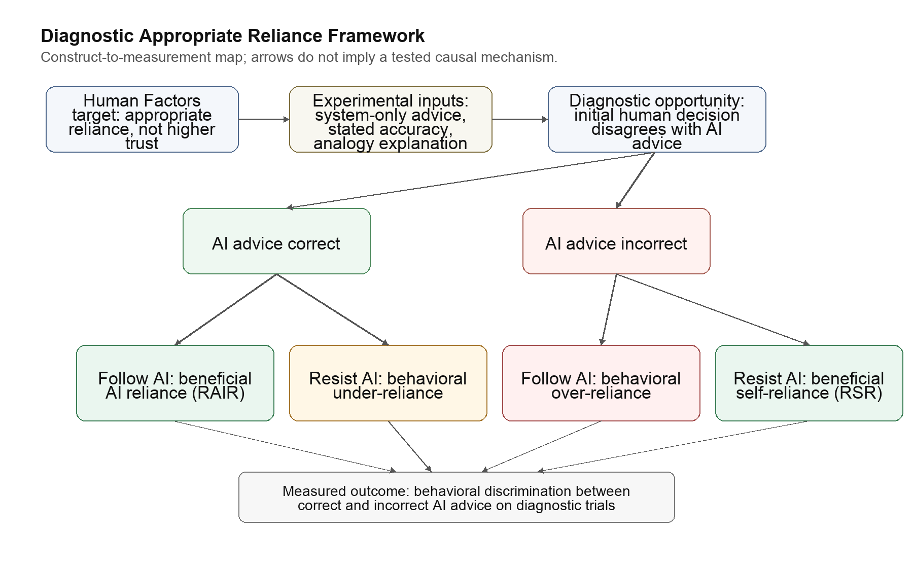

# Beyond Over-Reliance: Diagnostic Evidence of Under-Reliance in AI Advice Taking

Hosung You

Pennsylvania State University, College of Education

Running head: BEYOND OVER-RELIANCE

Manuscript type: Research Article

Text word count: 2393

Author Note

No funding, acknowledgments, or conflicts of interest are reported for this draft. Correspondence concerning this article should be addressed to Hosung You, College of Education, Pennsylvania State University.

## Abstract

**Objective:** To reanalyze AI advice taking as diagnostic appropriate reliance rather than as general trust or final agreement with AI.

**Background:** Human Factors theory treats the design target as appropriate reliance: accepting reliable automation while resisting unreliable automation. Recent human-AI decision-making work operationalizes this target through relative AI reliance and relative self-reliance.

**Method:** The 4TU loan approval reliance dataset was reanalyzed using diagnostic trials in which participants' initial decisions disagreed with AI recommendations. Relative AI reliance, relative self-reliance, over-reliance, and under-reliance were computed from AI correctness and post-advice behavior.

**Results:** Descriptive summaries showed lower relative AI reliance than relative self-reliance across main-experiment conditions. Baseline mixed-effects models did not provide clear evidence that stated accuracy information or analogy-based explanation improved diagnostic reliance relative to system-only advice.

**Conclusion:** The findings suggest that behavioral under-reliance can be a consequential calibration failure and that final agreement with AI is insufficient for measuring reliance quality.

**Application:** AI advice interfaces should be evaluated by whether they improve case-level discrimination between correct and incorrect advice, not merely by whether they increase trust or agreement.

*Keywords:* AI advice, trust calibration, appropriate reliance, under-reliance, Human Factors

**Précis:** This secondary analysis applies appropriate reliance measurement to AI advice taking. Diagnostic trials separate warranted uptake from mere agreement and show that under-reliance on correct advice may be as design-relevant as over-reliance on wrong advice.

## Beyond Over-Reliance: Diagnostic Evidence of Under-Reliance in AI Advice Taking

AI advice systems increasingly support consequential judgments in domains such as medicine, finance, education, and public administration. The central design problem is not simply whether people trust these systems, but whether they rely on them appropriately. A user who follows incorrect advice may be harmed by misuse, whereas a user who rejects correct advice may lose the intended benefit of decision support. Human Factors research has long treated this distinction as fundamental: automation can be misused, disused, or abused, and effective design requires aligning human reliance with automation capability rather than merely increasing use (Parasuraman & Riley, 1997).

This paper uses that tradition to frame a secondary analysis of the 4TU loan approval reliance dataset. The dataset contains a participant decision before AI advice, the AI recommendation, a participant decision after AI advice, and the correct task label. That structure allows reliance to be measured behaviorally. Rather than infer trust from self-report alone or from general agreement with AI advice, the analysis asks whether users accept correct AI recommendations and resist incorrect ones.

The contribution is therefore not a new measurement instrument. Instead, the paper applies the appropriate reliance measurement logic of relative AI reliance and relative self-reliance to a dataset with pre-advice and post-advice decisions (Schemmer et al., 2023). The resulting analysis shows why diagnostic trials are necessary for separating warranted uptake from mere agreement and why under-reliance deserves equal attention with over-reliance in AI advice taking.

## Theoretical Foundation

The first theoretical anchor is the distinction among use, misuse, disuse, and abuse of automation. Parasuraman and Riley (1997) argued that automation problems cannot be reduced to use versus nonuse. People may overuse unreliable automation, underuse reliable automation, or be placed in organizational conditions that encourage inappropriate dependence. In AI advice taking, this distinction maps directly onto over-reliance and under-reliance. Over-reliance occurs when a user follows wrong AI advice. Under-reliance occurs when a user rejects correct AI advice.

The second anchor is Lee and See's (2004) account of trust in automation as a basis for appropriate reliance. Their framework is useful because it rejects the idea that the goal of design is higher trust. Trust is valuable only insofar as it supports reliance that is warranted by system capability. Earlier experimental work on trust in automation similarly showed that human intervention changes as system reliability is experienced and evaluated (Muir & Moray, 1996). A system that raises trust without improving users' ability to discriminate good from bad advice may produce more confident but not more calibrated behavior.

The third anchor is the integrative model of trust in automation developed by Hoff and Bashir (2015). Their distinction among dispositional, situational, and learned trust is useful for organizing candidate predictors, but the present analysis uses that model cautiously. Because the available data do not establish that participants received trial-by-trial correctness feedback, task position is treated as an order, exposure, fatigue, or growing-skepticism proxy rather than as a direct measure of learned trust.

Recent work on dynamic and resilient trust further supports the view that reliance should be evaluated as an adaptive relation between human judgment and system performance (Chiou & Lee, 2023). In the present study, this principle is operationalized more narrowly: the relevant behavioral question is whether participants changed their final decision differently when AI advice was correct than when it was incorrect.

Finally, current AI advice research provides the measurement bridge. Schemmer et al. (2023) define appropriate reliance through beneficial AI reliance and beneficial self-reliance: users should rely on AI when its advice is correct and self-rely when AI advice is incorrect. Work on confidence and explanation in AI-assisted decision making similarly shows that transparency cues must be judged by whether they improve accuracy and calibration, not simply by whether they increase trust (Zhang et al., 2020). Figure 1 shows the theoretical framework that connects Human Factors reliance theory to the diagnostic measurement strategy. Table 1 summarizes how these anchors are used in the manuscript.

**Figure 1**

*Diagnostic Appropriate Reliance Framework*

Note. The figure maps Human Factors reliance theory to the RAIR/RSR measurement logic. It is a construct-to-measurement map, not a tested causal mechanism.

**Table 1**

*Human Factors Anchors for the Manuscript*

| Anchor | Use in the Manuscript |
| --- | --- |
| Parasuraman & Riley (1997) | Frames over-reliance as misuse and under-reliance as disuse. |
| Lee & See (2004) | Defines the design target as appropriate reliance rather than higher trust. |
| Hoff & Bashir (2015) | Organizes candidate trust predictors while avoiding overclaiming about learned trust. |
| Chiou & Lee (2023) | Supports a dynamic view of reliance as adaptation to system performance. |
| Schemmer et al. (2023) | Provides the appropriate reliance, RAIR, and RSR measurement logic. |

Note. RAIR = relative AI reliance; RSR = relative self-reliance.

## Research Questions

RQ1 asks whether stated accuracy information changes diagnostic appropriate reliance relative to system-only advice. The theoretically relevant pattern is not simply more AI following, but increased uptake of correct advice without increased uptake of incorrect advice.

RQ2 asks whether analogy-based explanation changes diagnostic appropriate reliance beyond numeric accuracy information. Analogy explanations may make system accuracy easier to interpret, but they may also create an illusion of understanding without improving behavioral discrimination.

RQ3 asks whether diagnostic miscalibration appears more strongly as over-reliance on wrong AI advice or as under-reliance on correct AI advice. This question challenges an overtrust-only framing of AI risk.

## Method

This study was a secondary analysis of the 4TU loan approval reliance dataset. Participants completed loan approval decisions with AI advice. The available structure included an initial participant decision, an AI recommendation, a final participant decision, the correct loan decision, experimental condition, and post-task trust or automation-attitude measures. The data were collected at Delft University of Technology between July 2021 and January 2023 and released through 4TU.ResearchData as the user interaction dataset associated with the CSCW 2023 study by He, Buijsman, and Gadiraju (2023; He et al., 2025). The processed files contained 5,786 trial-level rows and 529 participant-level rows, including 281 participants in the main experiment and 248 participants in the follow-up study.

The original 4TU deposit confirmed that user responses were collected through Prolific. The main-experiment Prolific demographic file contained 281 rows; one participant lacked a valid age value, yielding age information for 280 participants. The main-experiment sample had a mean age of 27.43 years (SD = 8.64, range = 18–61); 197 participants were listed as female, 80 as male, 2 as prefer not to say, and 2 as data expired. The follow-up demographic files contained 248 rows, with a mean age of 37.98 years (SD = 12.98, range = 19–78); 124 participants were listed as female and 124 as male. All participants in both released demographic files listed English as first language.

The main experiment included three user groups: system-only advice, advice with stated accuracy information, and advice with analogy-based accuracy explanation. The follow-up study included a loan analogy condition with variation across analogy domains. The primary analysis focused on the main experiment, with the follow-up treated as a secondary descriptive check.

The key design choice was to distinguish all advice trials from diagnostic trials. A diagnostic trial was one in which the participant's initial decision disagreed with the AI recommendation. If a participant already agreed with the AI before receiving advice, post-advice agreement does not reveal whether the participant relied on the AI. Diagnostic trials therefore isolate the cases where accepting or resisting AI advice is behaviorally informative.

The processed trial file was complete for the reconstructed analysis variables used here. No missing values were observed for study, user group, task, AI correctness, initial choice, final choice, or diagnostic-trial indicators in the processed rows. The original main-experiment analysis scripts used a time threshold, attention checks, and questionnaire-completeness checks to define valid participants. The released main-experiment demographic file had no participants below the 420-second time threshold used in those scripts. The follow-up analysis scripts emphasized completeness of user task and questionnaire records; the released follow-up userinfo and demographic files both contained 248 participants.

**Table 2**

*Sample and Demographic Summary From the Original 4TU Deposit*

| Study | N | Age M (SD) | Age Range | Sex |
| --- | --- | --- | --- | --- |
| Main experiment | 281 | 27.43 (8.64) | 18–61 | Female = 197; Male = 80; Prefer not to say = 2; Data expired = 2 |
| Follow-up study | 248 | 37.98 (12.98) | 19–78 | Female = 124; Male = 124 |

Note. Demographic values were computed from the Prolific demographic files in the original 4TU deposit. Main-experiment age statistics use n = 280 because one age value was not in the valid 18–100 range. All released demographic rows listed English as first language.

### Measures

The primary measurement framework was appropriate reliance, operationalized using the logic of relative AI reliance and relative self-reliance (Schemmer et al., 2023). In this dataset, relative AI reliance refers to the proportion of AI-correct diagnostic trials in which the participant switched toward or followed the correct AI recommendation. Relative self-reliance refers to the proportion of AI-wrong diagnostic trials in which the participant resisted the incorrect AI recommendation and retained the correct human judgment.

Over-reliance was coded when the AI recommendation was wrong and the participant followed it on a diagnostic trial. Under-reliance was coded when the AI recommendation was correct and the participant rejected it on a diagnostic trial. In this paper, under-reliance means failure to adopt objectively correct AI advice under the dataset label; it does not necessarily imply irrational distrust, because participants may have perceived ambiguity or had other reasons for maintaining their initial judgment.

Final follows AI indicated whether the post-advice decision matched the AI recommendation. This measure was retained descriptively, but it was not treated as a sufficient calibration measure because it includes cases where the participant already agreed with the AI before advice. Table 3 defines the main behavioral measures.

**Table 3**

*Operational Definitions*

| Construct | Operational Definition |
| --- | --- |
| Diagnostic trial | Initial participant decision disagreed with the AI recommendation. |
| Relative AI reliance | AI was correct and the participant followed or switched toward the AI recommendation. |
| Relative self-reliance | AI was wrong and the participant resisted the AI recommendation. |
| Over-reliance | AI was wrong and the participant followed AI on a diagnostic trial. |
| Under-reliance | AI was correct and the participant rejected AI on a diagnostic trial. |
| Final follows AI | Post-advice decision matched the AI recommendation. |

Note. AI = artificial intelligence. Relative AI reliance and relative self-reliance follow the appropriate reliance logic of Schemmer et al. (2023).

### Analytic Strategy

The primary mixed-effects logistic model used diagnostic trials from the main experiment. The outcome was diagnostic appropriate reliance, with user group, AI correctness, their interaction, and task position as fixed effects. Participant and task were included as random intercepts to account for repeated observations.

Separate models examined over-reliance among trials where the AI was wrong and under-reliance among trials where the AI was correct. These models were necessary because a condition could reduce one kind of error while increasing the other. Reporting only final accuracy or overall agreement with AI would obscure this asymmetry.

The baseline models were interpreted cautiously. Nonsignificant condition coefficients were not treated as evidence of no effect. Stronger claims about null effects would require equivalence testing, Bayesian evidence, or a defined minimum effect of practical interest.

Additional robustness checks examined condition balance descriptively. These checks compared participant counts, diagnostic-trial fractions, AI-correct diagnostic opportunity fractions, initial accuracy, final accuracy, and accuracy gain across the main-experiment conditions. A planned initial-correctness covariate was not included in the diagnostic models because, on binary diagnostic trials, initial correctness is structurally determined by AI correctness.

## Results

Diagnostic-trial accounting supported the feasibility of the measurement approach. In the main experiment, 488 of 920 trials in the accuracy condition, 544 of 1,020 trials in the analogy condition, and 433 of 870 trials in the system-only condition were diagnostic. Table 4 reports the diagnostic trial counts, AI-correct and AI-wrong opportunity counts, and the corresponding relative AI reliance and relative self-reliance rates.

The descriptive pattern indicated more difficulty adopting correct AI advice than resisting incorrect AI advice. In the main experiment, relative AI reliance was .431 in the accuracy condition, .357 in the analogy condition, and .415 in the system-only condition. Relative self-reliance was .540, .466, and .514, respectively. The follow-up loan analogy condition showed the same direction: relative AI reliance was .344, whereas relative self-reliance was .640. Wilson confidence intervals are reported in Table 4.

The baseline diagnostic mixed-effects model did not provide clear evidence that accuracy information or analogy explanation improved appropriate reliance relative to system-only advice. The condition coefficients and condition-by-AI correctness interactions were not statistically clear in the baseline model. In these baseline models, there was no clear evidence that the transparency cues improved diagnostic reliance.

The condition-balance checks did not show large differences in diagnostic-trial fractions across main-experiment groups: .530 for accuracy, .533 for analogy, and .498 for system-only advice. Initial accuracy was similar in the accuracy and system-only conditions (.443 in both) and lower in the analogy condition (.394), which should be considered when interpreting descriptive condition differences. Table 6 reports these checks.

Robustness checks using logistic models with task fixed effects and user-clustered standard errors were consistent with the baseline mixed-effects interpretation. Planned contrasts showed no clear evidence that accuracy information improved diagnostic appropriate reliance relative to system-only advice (OR = 1.08, 95% CI [0.61, 1.92]) or that analogy explanation improved diagnostic appropriate reliance relative to accuracy information (OR = 0.75, 95% CI [0.43, 1.30]). The task-position association with under-reliance remained in the robustness model (OR = 1.07, 95% CI [1.02, 1.12]). Table 7 reports the robustness checks.

The separate over-reliance model did not show clear condition differences. The under-reliance model also did not show clear condition differences, but task position was positively associated with under-reliance in the baseline output. This pattern may reflect order, exposure, fatigue, growing skepticism, or task composition; it is treated as a robustness-check target rather than as a settled theoretical conclusion. Table 5 reports the baseline model estimates.

**Table 4**

*Diagnostic Trial Accounting and Appropriate Reliance Indicators*

| Study/Group | Diagnostic Trials | AI-Correct Trials | AI-Wrong Trials | RAIR [95% CI] | RSR [95% CI] |
| --- | --- | --- | --- | --- | --- |
| Main/accuracy | 488/920 | 362 | 126 | .431 [.381, .482] | .540 [.453, .624] |
| Main/analogy | 544/1,020 | 428 | 116 | .357 [.314, .404] | .466 [.377, .556] |
| Main/system | 433/870 | 328 | 105 | .415 [.363, .469] | .514 [.420, .608] |
| Follow-up/loan analogy | 1,583/2,976 | 1,269 | 314 | .344 [.319, .371] | .640 [.586, .691] |

Note. RAIR = relative AI reliance, the proportion of AI-correct diagnostic trials in which the participant followed AI. RSR = relative self-reliance, the proportion of AI-wrong diagnostic trials in which the participant resisted AI. Values are trial-level summaries from processed 4TU files. Confidence intervals are Wilson intervals for proportions.

**Table 5**

*Baseline Mixed-Effects Logistic Model Estimates*

| Model/Term | b | OR [95% CI] | p |
| --- | --- | --- | --- |
| Appropriate reliance: accuracy | 0.099 | 1.10 [0.63, 1.93] | .726 |
| Appropriate reliance: analogy | -0.216 | 0.81 [0.46, 1.42] | .455 |
| Appropriate reliance: AI correct | 0.030 | 1.03 [0.64, 1.66] | .904 |
| Appropriate reliance: task position | -0.030 | 0.97 [0.93, 1.01] | .134 |
| Appropriate reliance: accuracy x AI correct | -0.006 | 0.99 [0.53, 1.87] | .986 |
| Appropriate reliance: analogy x AI correct | -0.085 | 0.92 [0.49, 1.74] | .794 |
| Over-reliance: accuracy | -0.047 | 0.95 [0.53, 1.71] | .875 |
| Over-reliance: analogy | 0.193 | 1.21 [0.67, 2.19] | .521 |
| Over-reliance: task position | -0.078 | 0.92 [0.85, 1.00] | .056 |
| Under-reliance: accuracy | -0.141 | 0.87 [0.54, 1.39] | .557 |
| Under-reliance: analogy | 0.312 | 1.37 [0.86, 2.16] | .183 |
| Under-reliance: task position | 0.083 | 1.09 [1.03, 1.14] | .002 |

Note. OR = odds ratio. CIs are Wald intervals computed from model estimates and standard errors in the baseline mixed-effects outputs. The reference group for user group is system-only advice. Models included random intercepts for participant and task.

**Table 6**

*Main-Experiment Condition Balance and Robustness Checks*

| Group | Participants | Trials | Diagnostic Fraction | AI-Correct Diagnostic Fraction | Initial Accuracy | Final Accuracy | Accuracy Gain |
| --- | --- | --- | --- | --- | --- | --- | --- |
| Accuracy | 92 | 920 | .530 | .742 | .443 | .551 | .108 |
| Analogy | 102 | 1,020 | .533 | .787 | .394 | .482 | .088 |
| System-only | 87 | 870 | .498 | .758 | .443 | .536 | .092 |

Note. Accuracy values are participant-level means from the processed participant summary file. Diagnostic fractions and AI-correct diagnostic fractions are trial-level summaries. Initial correctness was not added as a diagnostic-model covariate because it is structurally determined by AI correctness on binary diagnostic trials.

**Table 7**

*Task-Fixed-Effects and Planned-Contrast Robustness Checks*

| Check | OR [95% CI] | p |
| --- | --- | --- |
| Appropriate reliance: accuracy vs system | 1.08 [0.61, 1.92] | .792 |
| Appropriate reliance: analogy vs system | 0.81 [0.45, 1.47] | .494 |
| Appropriate reliance: analogy vs accuracy | 0.75 [0.43, 1.30] | .309 |
| Appropriate reliance: accuracy x AI correct | 1.01 [0.46, 2.20] | .982 |
| Appropriate reliance: analogy x AI correct | 0.91 [0.41, 2.00] | .815 |
| Over-reliance: analogy vs system | 1.22 [0.66, 2.27] | .528 |
| Under-reliance: analogy vs system | 1.34 [0.90, 1.99] | .151 |
| Under-reliance: task position | 1.07 [1.02, 1.12] | .003 |

Note. Robustness checks used logistic generalized linear models with task fixed effects and standard errors clustered by participant. These models supplement, rather than replace, the baseline mixed-effects models.

## Discussion

The main contribution is a diagnostic application of appropriate reliance measurement to AI advice taking. Many studies measure trust through self-report or measure reliance through final agreement with AI output. Both can be useful, but neither is sufficient for calibration. Calibration requires knowing whether the AI was correct and whether the participant had a meaningful opportunity to accept or reject the advice.

The second contribution is substantive. The descriptive pattern suggests that under-reliance may be a central failure mode in AI advice taking. This matters for Human Factors because the cost of poor calibration is not only that users defer to erroneous systems. It is also that users fail to benefit from systems when they are correct.

The third contribution concerns transparency. Stated accuracy and analogy explanation are plausible design interventions, but the current baseline results do not show clear improvement in diagnostic appropriate reliance. Interpreted as a design implication, this pattern suggests that transparency cues may need to be paired with procedural support for deciding when advice should be accepted or resisted. Future systems may need interactive calibration scaffolds, feedback on advice quality, uncertainty communication tied to task-specific evidence, or training sequences that expose both correct and incorrect AI behavior.

The education connection should remain deliberately modest. The 4TU loan approval dataset does not test learning outcomes, classroom interaction, or educational scaffold fading. Its value for educational AI is methodological. It shows how a future educational AI study could measure behavioral calibration if the system logged initial learner judgment, AI recommendation, final learner judgment, and the correctness or quality of the AI advice.

### Limitations and Future Directions

Several limitations should be foregrounded. The task was loan approval rather than an educational task. The analysis was secondary and therefore constrained by the original experimental design. The data were not longitudinal in the sense required to study learning trajectories. The baseline models also require additional robustness checks before submission.

The present draft adds condition-balance checks, planned contrasts, task fixed-effects robustness models, and uncertainty intervals for relative AI reliance and relative self-reliance. Future revisions should still add equivalence or Bayesian evidence for null claims, correct for multiple comparisons across secondary outcomes, and replicate the analysis directly from the raw 4TU files rather than from the processed reconstruction alone.

The manuscript keeps subjective trust and behavioral reliance separate. Post-task trust scales can help explain reliance, but they are not be treated as equivalent to reliance itself. The strongest claim is that calibrated AI advice use requires behavioral discrimination: following correct advice and resisting wrong advice when the user initially disagrees with the system.

## Key Points

- Diagnostic trials isolate moments when AI advice can meaningfully change a user's judgment.
- Relative AI reliance and relative self-reliance provide established behavioral indicators of appropriate reliance.
- Across 4TU condition summaries, participants were less likely to adopt correct AI advice than to resist incorrect AI advice.
- Accuracy disclosure and analogy explanation did not show clear baseline evidence of improving diagnostic reliance.
- Design evaluation should distinguish trust attitudes, final agreement with AI, and behavioral reliance calibration.

## References

Chiou, E. K., & Lee, J. D. (2023). Trusting automation: Designing for responsivity and resilience. Human Factors, 65(1), 137–165. https://doi.org/10.1177/00187208211009995

Hoff, K. A., & Bashir, M. (2015). Trust in automation: Integrating empirical evidence on factors that influence trust. Human Factors, 57(3), 407–434. https://doi.org/10.1177/0018720814547570

He, G., Buijsman, S., & Gadiraju, U. (2023). How stated accuracy of an AI system and analogies to explain accuracy affect human reliance on the system. Proceedings of the ACM on Human-Computer Interaction, 7(CSCW2), Article 276. https://doi.org/10.1145/3610067

He, G., Buijsman, S., & Gadiraju, U. (2025). User interaction dataset for CSCW 2023 paper "How Stated Accuracy of an AI System and Analogies to Explain Accuracy Affect Human Reliance on the System" (Version 1) [Data set]. 4TU.ResearchData. https://doi.org/10.4121/f211863d-331b-44e5-a184-c21a18ac831a.v1

Lee, J. D., & See, K. A. (2004). Trust in automation: Designing for appropriate reliance. Human Factors, 46(1), 50–80. https://doi.org/10.1518/hfes.46.1.50_30392

Muir, B. M., & Moray, N. (1996). Trust in automation. Part II. Experimental studies of trust and human intervention in a process control simulation. Ergonomics, 39(3), 429–460. https://doi.org/10.1080/00140139608964474

Parasuraman, R., & Riley, V. (1997). Humans and automation: Use, misuse, disuse, abuse. Human Factors, 39(2), 230–253. https://doi.org/10.1518/001872097778543886

Schemmer, M., Kühl, N., Benz, C., Bartos, A., & Satzger, G. (2023). Appropriate reliance on AI advice: Conceptualization and the effect of explanations. In Proceedings of the 28th International Conference on Intelligent User Interfaces (pp. 410–422). Association for Computing Machinery. https://doi.org/10.1145/3581641.3584066

Wischnewski, M., Krämer, N. C., & Müller, E. (2023). Measuring and understanding trust calibrations for automated systems: A survey of the state-of-the-art and future directions. In Proceedings of the 2023 CHI Conference on Human Factors in Computing Systems (Article 755, pp. 1–16). Association for Computing Machinery. https://doi.org/10.1145/3544548.3581197

Zhang, Y., Liao, Q. V., & Bellamy, R. K. E. (2020). Effect of confidence and explanation on accuracy and trust calibration in AI-assisted decision making. In Proceedings of the 2020 Conference on Fairness, Accountability, and Transparency (pp. 295–305). Association for Computing Machinery. https://doi.org/10.1145/3351095.3372852
