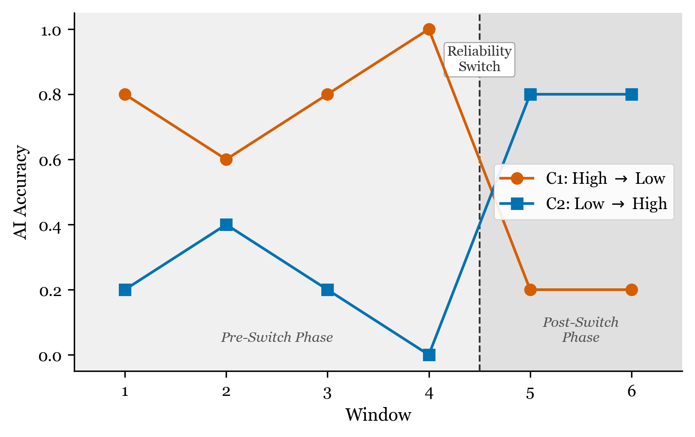
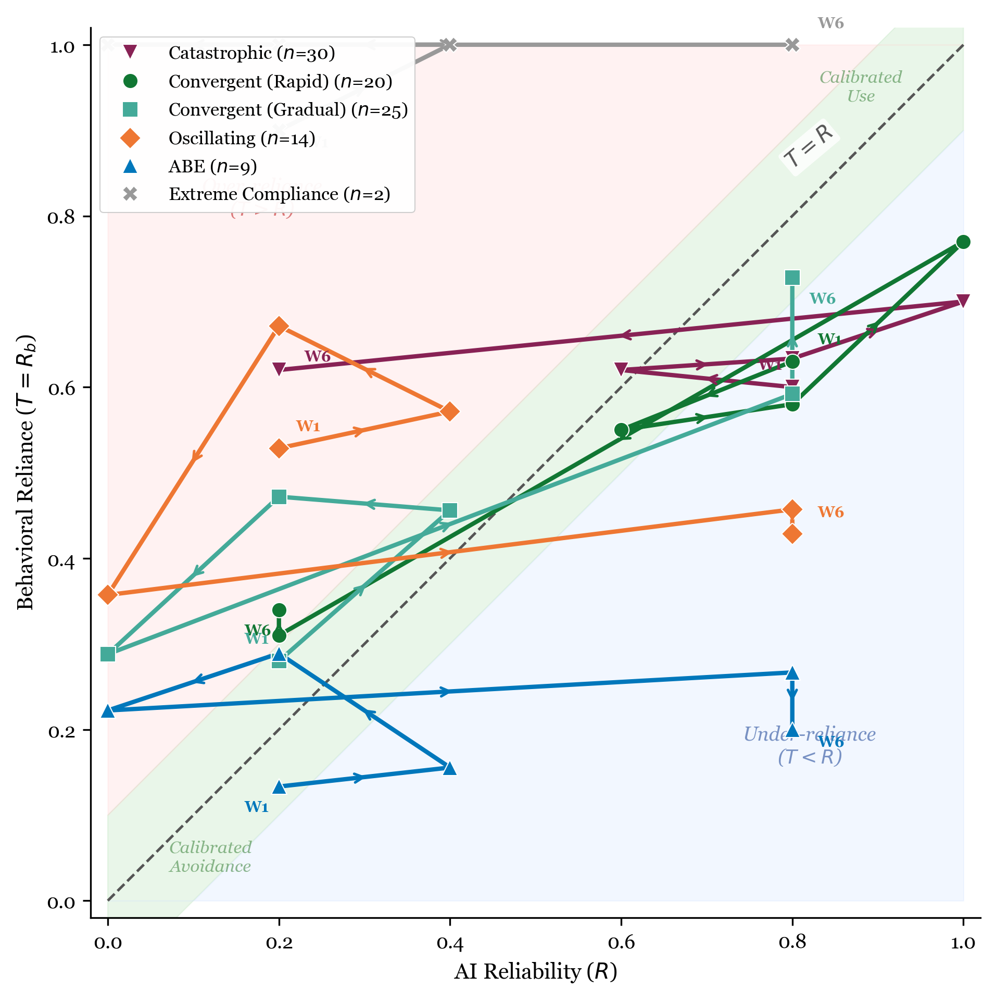
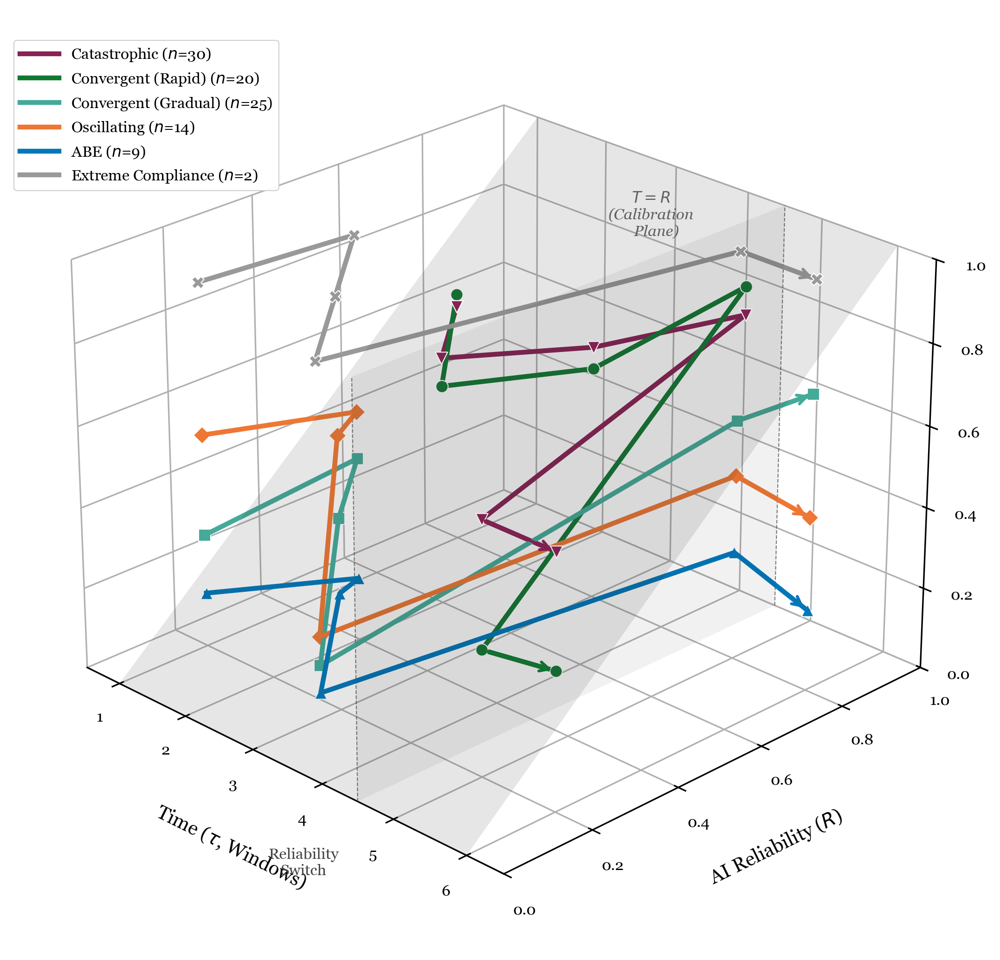
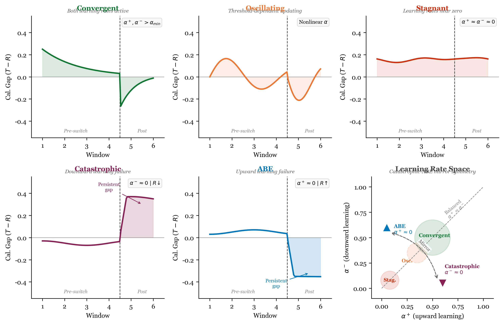
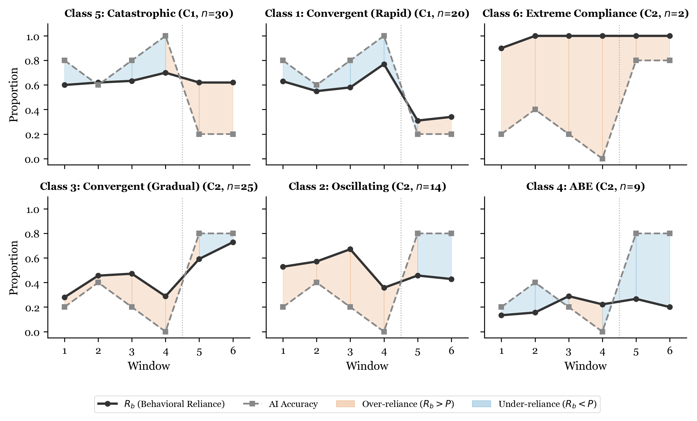
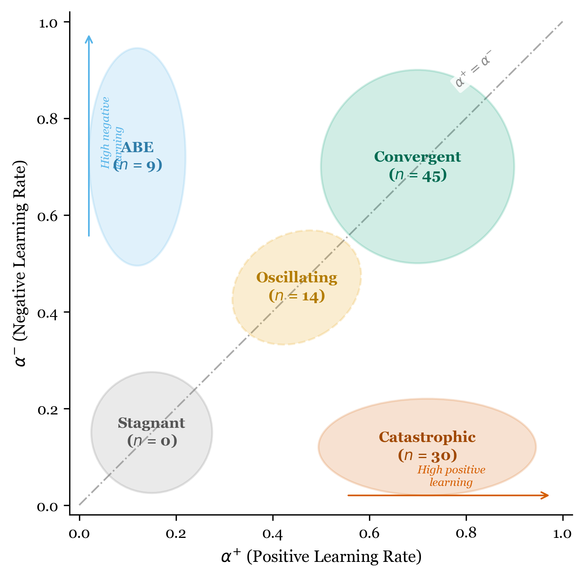
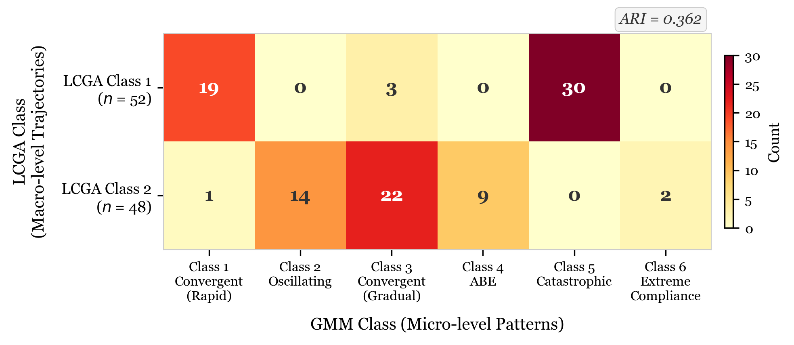

Running head: TRUST CALIBRATION TRAJECTORIES

&nbsp;

&nbsp;

&nbsp;

&nbsp;

&nbsp;

**Trust Calibration Trajectories Under Experimental Reliability Switches:**

**A Latent Class Growth Analysis of Chess Puzzle Solving With AI Recommendations**

&nbsp;

Hosung You

College of Education, Pennsylvania State University

&nbsp;

**Author Note**

Hosung You https://orcid.org/0000-0000-0000-0000

College of Education, Pennsylvania State University.

This study was pre-registered on the Open Science Framework (https://doi.org/10.17605/OSF.IO/JMQ84). The dataset analyzed in this study is publicly available from Bondi et al. (2023). The author has no conflicts of interest to disclose.

Correspondence concerning this article should be addressed to Hosung You, College of Education, Pennsylvania State University, University Park, PA 16802. Email: hosung@psu.edu

&nbsp;

&nbsp;

&nbsp;

---

**Abstract**

Trust calibration—the alignment between a user's reliance on an AI system and the system's actual reliability—is critical for effective human-AI collaboration. While prior research has examined trust as a unidimensional construct, few studies have investigated the heterogeneity of trust calibration *trajectories* over time. Using data from an experimental chess puzzle study (*N* = 100 sessions, 50 participants in two conditions), we applied complementary analytic approaches—Latent Class Growth Analysis (LCGA) and Gaussian Mixture Model (GMM) clustering—to identify distinct trust calibration trajectory patterns following experimental reliability switches. LCGA identified two macro-level trajectory classes corresponding to experimental conditions (Entropy = 0.871, 96% classification accuracy), confirming the manipulation's effectiveness. GMM revealed six micro-level subgroups within conditions, mapping onto five theoretically derived trajectory patterns: Convergent, Catastrophic, Oscillating, AI Benefit Emergence (ABE), and Extreme Compliance. In the High-to-Low reliability condition, 60% of participants exhibited Catastrophic over-reliance (trust inertia despite AI accuracy dropping from 100% to 20%), while 40% showed rapid Convergent adaptation. In the Low-to-High condition, 50% converged gradually, 28% oscillated, and 18% showed ABE—persistent under-reliance despite AI improvement. These findings provide the first experimental evidence for a five-pattern typology of trust calibration dynamics, with implications for designing adaptive AI systems that account for individual differences in trust updating.

*Keywords:* trust calibration, human-AI interaction, latent class growth analysis, trust trajectory, reliability switch, automation trust

---

**Trust Calibration Trajectories Under Experimental Reliability Switches: A Latent Class Growth Analysis of Chess Puzzle Solving With AI Recommendations**

## Trust Calibration in Human-AI Interaction

The rapid integration of artificial intelligence systems into decision-making contexts—from medical diagnosis to educational tutoring—has elevated the importance of appropriate reliance on AI recommendations. Trust calibration, defined as the correspondence between a user's trust in an AI system and the system's actual trustworthiness, is essential for effective human-AI collaboration (Lee & See, 2004). Miscalibrated trust leads to two types of errors: over-reliance (following AI recommendations when the system is unreliable) and under-reliance (ignoring AI recommendations when the system is reliable; Parasuraman & Riley, 1997).

Prior research has primarily examined trust as a static or aggregate construct, measuring overall trust levels or mean reliance rates across experimental conditions (e.g., Dzindolet et al., 2003). However, trust is inherently dynamic—it develops, fluctuates, and sometimes deteriorates over the course of interaction (Lee & Moray, 1992; Muir & Moray, 1996). Understanding these dynamics requires moving beyond aggregate measures to examine individual trust *trajectories* over time.

## The Need for Trajectory-Based Analysis

Recent theoretical developments suggest that individuals do not follow a single, universal trust adaptation pattern. Instead, qualitatively distinct trajectory types may emerge depending on individual differences in trust updating mechanisms and the specific environmental conditions encountered (You, 2026).

We propose a Bayesian Trust Update Model in which trust at time *t* + 1 is updated according to a prediction error signal:

$$T_{t+1} = T_t + \begin{cases} \alpha^+ \cdot \delta_t & \text{if } \delta_t \geq 0 \\ \alpha^- \cdot \delta_t & \text{if } \delta_t < 0 \end{cases}$$

where $\delta_t = R_t - T_t$ is the prediction error (discrepancy between observed AI reliability and current behavioral trust), and $\alpha^+$ and $\alpha^-$ are asymmetric learning rates for positive and negative prediction errors, respectively.

## The Trust Calibration Space

To formalize the dynamics of trust calibration, we define the Trust Calibration Space $\mathcal{S} = [0,1] \times [0,1] \times \mathbb{Z}^+$ as a three-dimensional space characterized by:

- $T_t \in [0,1]$: Behavioral trust at time *t*, operationalized as behavioral reliance rate *R*~b~.
- $R_t \in [0,1]$: AI reliability at time *t*, operationalized as AI accuracy *P*.
- $\tau \in \mathbb{Z}^+$: Discrete time index representing sequential interaction windows.

The calibration gap at time *t* is defined as $G_t = T_t - R_t$, where $G > 0$ indicates over-reliance (behavioral trust exceeds AI capability), $G < 0$ indicates under-reliance (behavioral trust falls below AI capability), and $G = 0$ represents perfect calibration. A trust trajectory is thus a path through this three-dimensional space, $\{(T_t, R_t, \tau)\}_{t=1}^{N}$, and the goal of trust calibration research is to characterize the geometry and dynamics of these paths.

### The Trust-Reliability Matrix

In the $T \times R$ plane (collapsing across time), four theoretically meaningful regions emerge relative to the identity diagonal $T = R$:

- **Calibrated** ($T \approx R$): Behavioral reliance is appropriately matched to AI capability, falling near the diagonal.
- **Over-reliance** ($T > R$): Behavioral trust exceeds AI capability, located above the diagonal.
- **Under-reliance** ($T < R$): Behavioral trust falls below AI capability, located below the diagonal.

The experimental design creates a powerful test of this framework: C1 (High-to-Low) forces participants from the calibrated region toward potential over-reliance as reliability drops, while C2 (Low-to-High) forces participants toward potential under-reliance as reliability increases. Whether and how quickly participants recalibrate—returning to the diagonal—reveals their trust updating characteristics. Figure 2 illustrates this matrix with the chess GMM trajectory data projected into the $T \times R$ plane.

### Trust Hysteresis

A key prediction from the asymmetric learning rate model ($\alpha^+ \neq \alpha^-$) is trust hysteresis: the path of trust erosion (when *R* decreases) differs from the path of trust building (when *R* increases). Specifically, when $\alpha^- > \alpha^+$ (the canonical expectation from Lee & Moray, 1992), trust erodes faster than it builds, creating a hysteresis loop in the $T \times R$ space. Conversely, when automation complacency dominates ($\alpha^- \approx 0$), the erosion path is nearly flat while the building path shows gradual increase. The experimental design with its explicit reliability switch—and the contrasting C1 and C2 conditions—provides a direct test of this asymmetry, as the same participants experience both trust erosion and trust building contexts. Figure 3 visualizes the full three-dimensional trajectories in the Trust Calibration Space $\mathcal{S}$.

## Five Theoretically Derived Trajectory Patterns

This model predicts five distinct trajectory patterns based on different configurations of the learning rate parameters (see Figure 4 for a visual summary of the theoretical predictions in the chess context):

1. **Convergent** ($\alpha^+, \alpha^- > \alpha_{min}$): Trust gradually converges toward actual reliability, regardless of direction. Both learning rates are active and sufficient.

2. **Stagnant** ($\alpha^+ \approx \alpha^- \approx 0$): Trust remains fixed near its initial level, unresponsive to changes in AI reliability. Behavioral inertia dominates.

3. **Catastrophic** ($\alpha^- \approx 0$; requires $R \downarrow$): When AI reliability drops suddenly (trust violation), the individual fails to reduce trust, maintaining over-reliance. Trust inertia manifests only in the downward direction.

4. **Oscillating** (nonlinear or threshold-dependent $\alpha$): Trust fluctuates non-monotonically around the reliability level, failing to achieve stable convergence. This may arise from overshooting corrections or threshold-dependent attention.

5. **AI Benefit Emergence (ABE)** ($\alpha^+ \approx 0$; requires $R \uparrow$): When AI reliability improves, the individual fails to increase trust, maintaining under-reliance. The mathematical mirror of the Catastrophic pattern. First identified inductively in exploratory analysis of educational data (You, 2026).

## The Present Study

The present study applies this theoretical framework to an experimental dataset featuring an explicit AI reliability switch, providing an ideal testbed for identifying trust calibration trajectories. Specifically, we analyze data from Bondi et al. (2023), in which participants solved chess puzzles with AI recommendations under two conditions: High-to-Low reliability (C1: AI accuracy ~80% then ~20%) and Low-to-High reliability (C2: AI accuracy ~20% then ~80%; see Figure 1).

We employ two complementary analytic approaches:

- **Latent Class Growth Analysis (LCGA)** to identify distinct trajectory *shapes* over time, modeling the temporal structure explicitly through piecewise linear growth curves.
- **Gaussian Mixture Model (GMM) clustering** to identify distinct behavioral *profiles* based on trajectory features, capturing within-condition heterogeneity.

### Research Questions

**RQ1:** Does the experimental reliability switch produce distinct trust calibration trajectory classes? (LCGA)

**RQ2:** Within each experimental condition, what distinct trajectory patterns emerge? (GMM)

**RQ3:** Do the empirically identified patterns correspond to the five theoretically predicted trajectory types?

**RQ4:** How do LCGA and GMM results relate to each other, and what complementary insights does each method provide?

### Hypotheses

**H1:** LCGA will identify at least two trajectory classes, primarily differentiated by experimental condition.

**H2:** In the C1 (High-to-Low) condition, at least two subgroups will emerge: one showing Catastrophic over-reliance (trust inertia) and one showing Convergent adaptation.

**H3:** In the C2 (Low-to-High) condition, at least two subgroups will emerge, including an ABE pattern (persistent under-reliance despite AI improvement).

**H4:** The Convergent pattern will be the most prevalent across both conditions.

**H5:** The calibration gap trajectory will show stronger condition differentiation than the raw behavioral reliance trajectory.

---

## Method

### Data Source

We conducted a secondary analysis of the experimental dataset from Bondi et al. (2023). The original study investigated human decision-making in chess puzzles with AI assistance.

### Participants and Design

The dataset comprised *N* = 100 sessions from 50 participants, each completing two sessions in different conditions. The study used a within-subject design with two conditions: C1 (High-to-Low), in which AI accuracy was approximately 80% in Windows 1–4 and then approximately 20% in Windows 5–6; and C2 (Low-to-High), in which AI accuracy was approximately 20% in Windows 1–4 and then approximately 80% in Windows 5–6. Participants selected the best chess move from options, with AI recommendations provided. Each session comprised 30 trials organized into six windows of five trials each. The reliability switch occurred between trials 20 and 21 (between Window 4 and Window 5).

### Ethical Considerations and Data Access

The dataset is publicly available from the original authors. Our secondary analysis was pre-registered on the Open Science Framework (OSF; https://doi.org/10.17605/OSF.IO/JMQ84).

### Measures

**Behavioral Reliance Rate (*R*~b~).** Behavioral reliance rate was computed as the number of trials where the participant followed the AI recommendation divided by the total trials in a given window. This was computed per window (five trials each), yielding six time points per session.

**AI Accuracy (*P*).** AI accuracy was computed as the number of trials where the AI recommendation was correct divided by the total trials in a given window. This was fixed by experimental design. Approximate values were ~80% (high reliability) or ~20% (low reliability) per window, with exact values varying due to the specific puzzles presented.

**Calibration Gap (*G*).** The calibration gap, defined as *G* = *R*~b~ − *P*, served as the primary outcome measure. Positive values indicate over-reliance (following AI more than warranted); negative values indicate under-reliance.

### Analytic Strategy

#### Phase 1: Descriptive Analysis

Window-level descriptive statistics by condition were computed, with particular focus on the switch effect between Windows 4 and 5.

#### Phase 2: Latent Class Growth Analysis

We used the `lcmm` R package (Proust-Lima et al., 2017) with the `hlme()` function to fit piecewise linear growth models to the calibration gap trajectory. The growth model was specified as:

$$G_{it} = \beta_0 + \beta_1 \cdot \text{Time}_t + \beta_2 \cdot \text{PostSwitch}_t + e_{it}$$

where Time~*t*~ = *t* − 1 (ranging from 0 to 5) and PostSwitch~*t*~ = max(0, Time~*t*~ − 3.5), a piecewise slope capturing post-switch trajectory change. A random intercept was specified (random = ~1). We fit models with *G* = 1 through 6 classes, using 30 random starting values per model (`gridsearch(rep = 30)`). Model selection was based on *BIC* (primary), SABIC, and entropy (for classification quality).

#### Phase 3: Gaussian Mixture Model Clustering

We used the `mclust` R package (Scrucca et al., 2016) to cluster sessions based on trajectory features extracted from the window-level data. Twenty features per session were extracted, including slopes, standard deviations, reversals, and maximum drops for *R*~b~, *G*, and appropriate reliance. Model selection was conducted using *BIC* across all Gaussian mixture model parameterizations (VEI, EII, etc.) and class numbers (*G* = 1 through 10).

#### Phase 4: Cross-Method Comparison

The Adjusted Rand Index (ARI) and cross-tabulation between LCGA and GMM class assignments were computed to evaluate convergence across analytic methods.

---

## Results

### Descriptive Results

The experimental manipulation produced large effects on the calibration gap. In C1 (High-to-Low), the calibration gap shifted from *M* = −0.164 (pre-switch) to *M* = +0.302 (post-switch), *d* = 2.10. The Window 4 to Window 5 jump was +0.568 (*SD* = 0.278). In C2 (Low-to-High), the calibration gap shifted from *M* = +0.211 (pre-switch) to *M* = −0.264 (post-switch), *d* = −2.06. The Window 4 to Window 5 jump was −0.612 (*SD* = 0.284). Both conditions showed very large effect sizes (|*d*| > 2.0), confirming that the reliability switch was a potent experimental manipulation.

### LCGA Results

#### Calibration Gap Trajectory Classes

Table 1 presents the model selection results for the calibration gap LCGA models. The two-class model was selected based on the lowest *BIC* (369.1), which was lower than the three-class model by a margin of 15.6 (see Table 1). Entropy for the two-class solution was 0.871, indicating good classification quality.

Class 1 (*n* = 52) consisted of 49 C1 and three C2 sessions. Class 2 (*n* = 48) consisted of 47 C2 and one C1 session. This represents 96% accuracy in condition classification, confirming that the experimental condition is the dominant determinant of the calibration gap trajectory (see Figure 5).

#### Behavioral Reliance Trajectory Classes

Behavioral reliance (*R*~b~) trajectories also yielded a two-class solution (*BIC* = 84.4, Entropy = 0.718), but with weaker condition separation: Class 1 (*n* = 88, all C1 + 39 C2) versus Class 2 (*n* = 12, one C1 + 11 C2). This supports H5: the calibration gap is a more sensitive indicator of condition effects than raw behavioral reliance.

### GMM Results

The six-class VEI model was selected based on *BIC* optimization across all parameterizations. All six classes achieved perfect condition separation (100% C1 or 100% C2 within each class), indicating that condition-driven variance dominated the feature space (see Figure 6 and Table 2). The six GMM classes occupy distinct regions of the Trust-Reliability Matrix (see Figure 2): C1 classes (Catastrophic and Convergent) move from the calibrated diagonal into the over-reliance region as reliability drops, while C2 classes (Convergent, Oscillating, and ABE) move from under-reliance toward the diagonal as reliability increases.

#### C1 (High-to-Low) Subgroups

**Class 5: Catastrophic Over-Reliance (*n* = 30, 60% of C1).** Despite AI accuracy plummeting from 1.000 to 0.200, *R*~b~ decreased by only 0.080 (from 0.700 to 0.620). The calibration gap jumped by +0.720, representing severe over-reliance. At Window 5 (post-switch), *R*~b~ = 0.620, AI accuracy = 0.200, and the calibration gap was +0.420. This pattern persisted at Window 6 (*R*~b~ = 0.620, gap = +0.420). This corresponds to the Catastrophic pattern ($\alpha^- \approx 0$; see Table 4).

**Class 1: Rapid Convergent Adaptation (*n* = 20, 40% of C1).** Behavioral reliance dropped by 0.460 upon the switch—a rapid, adaptive response. At Window 5, *R*~b~ = 0.310, AI accuracy = 0.200, and the calibration gap was +0.110, indicating near-appropriate calibration. This corresponds to the Convergent pattern ($\alpha^+, \alpha^- > \alpha_{min}$; see Table 4).

#### C2 (Low-to-High) Subgroups

**Class 3: Gradual Convergent Adaptation (*n* = 25, 50% of C2).** By Window 6, this group achieved a calibration gap of −0.072, approaching perfect calibration. Behavioral reliance increased from 0.288 to 0.728 as AI accuracy improved from 0% to 80%.

**Class 2: Oscillating Adaptation (*n* = 14, 28% of C2).** A non-monotonic *R*~b~ trajectory was observed (0.529, 0.571, 0.671, 0.357, 0.457, 0.429), with the highest gap variability (*SD*~gap~ = 0.421). This corresponds to the Oscillating pattern.

**Class 4: AI Benefit Emergence (*n* = 9, 18% of C2).** Despite AI accuracy of 80%, *R*~b~ remained at 0.200 and even *decreased* from Window 5 (*R*~b~ = 0.267) to Window 6 (*R*~b~ = 0.200). The calibration gap of −0.600 at Window 6 indicates severe under-reliance. This corresponds to the ABE pattern ($\alpha^+ \approx 0$; see Table 4).

**Class 6: Extreme Compliance (*n* = 2, 4% of C2).** Two sessions showed near-100% AI following regardless of accuracy, representing an extreme case of automation compliance.

### Theoretical Pattern Mapping

Table 2 summarizes the mapping from empirically observed GMM classes to theoretically predicted trajectory patterns. Five of six GMM classes map directly onto the five theoretically predicted patterns. The sixth class (Extreme Compliance, *n* = 2) represents an additional, theoretically unanticipated extreme case. This mapping is further illustrated in the Bayesian Trust Update Model parameter space (see Figure 7). The full three-dimensional trajectories of each GMM class through the Trust Calibration Space ($T \times R \times \tau$) are shown in Figure 3, revealing the distinct geometric paths that each pattern traces through the space.

### Cross-Method Comparison

The Adjusted Rand Index between LCGA (*G* = 2) and GMM (*G* = 6) class assignments was ARI = .362, reflecting moderate agreement (see Table 3 and Figure 8). Cross-tabulation revealed that LCGA Class 1 (C1-dominant) comprised GMM Class 1 (Convergent) and GMM Class 5 (Catastrophic), while LCGA Class 2 (C2-dominant) comprised GMM Classes 2, 3, and 4 (Oscillating, Convergent, and ABE, respectively). This confirms that LCGA captures condition-level macro-structure while GMM captures within-condition micro-heterogeneity. The two methods provide complementary, not redundant, information.

---

## Discussion

### Summary of Findings

This study provides the first experimental evidence for five distinct trust calibration trajectory patterns following AI reliability switches. Using complementary LCGA and GMM analyses of chess puzzle data with experimental reliability manipulation, three key findings emerged.

First, LCGA confirmed the experimental manipulation's effectiveness (*G* = 2, 96% condition separation), establishing that the reliability switch is the primary driver of trust calibration trajectories. Second, GMM revealed within-condition heterogeneity corresponding to five theoretically predicted patterns: Convergent, Catastrophic, Oscillating, ABE, and Extreme Compliance. Third, the Bayesian Trust Update Model successfully accounts for all observed patterns through different configurations of asymmetric learning rate parameters ($\alpha^+$, $\alpha^-$).

### Trust Violation: Catastrophic Versus Convergent (C1)

The most striking finding is the 60:40 split within the C1 (High-to-Low) condition. Sixty percent of participants exhibited Catastrophic over-reliance after the trust violation—maintaining high AI following (*R*~b~ dropped only 0.080) despite AI accuracy plummeting from 100% to 20%. The remaining 40% showed rapid Convergent adaptation (*R*~b~ dropped 0.460).

This bifurcation suggests that trust violation does not produce a uniform response. Instead, it activates qualitatively different trust updating mechanisms in different individuals. In terms of the Bayesian model, Catastrophic responders have $\alpha^- \approx 0$ (failure to learn from negative prediction errors), while Convergent responders have functional $\alpha^-$.

This finding extends prior work on automation complacency (Parasuraman et al., 1993) by demonstrating that complacency is not universal but characterizes a majority subgroup (60%), with a substantial minority capable of rapid recalibration.

### Trust Repair: Three Pathways (C2)

In the C2 (Low-to-High) condition, three distinct adaptation pathways emerged:

- **Gradual Convergence (50%).** The most common response, achieving near-perfect calibration (gap = −0.072 by Window 6).
- **Oscillation (28%).** Non-monotonic fluctuation, suggesting threshold-dependent or overshooting trust updating.
- **ABE (18%).** Persistent under-reliance (gap = −0.600) despite 80% AI accuracy.

The ABE pattern is particularly noteworthy. These participants had *lower* reliance at Window 6 (*R*~b~ = 0.200) than at Window 5 (*R*~b~ = 0.267), moving *away* from appropriate trust despite continued exposure to high-accuracy AI. This aligns with the "disuse" phenomenon (Parasuraman & Riley, 1997) and suggests that initial negative experiences can create persistent anchoring effects that override subsequent positive evidence (see also Tversky & Kahneman, 1974).

### Trust Hysteresis: Asymmetric Erosion and Building

The comparison between C1 (trust erosion) and C2 (trust building) reveals a striking asymmetry consistent with trust hysteresis. In C1, 60% of participants showed Catastrophic non-adaptation ($\alpha^- \approx 0$)—they failed to reduce trust when *R* dropped. In C2, 50% showed gradual Convergent adaptation but 18% showed ABE non-adaptation ($\alpha^+ \approx 0$). The fact that non-adaptation was more prevalent in the erosion direction (60%) than the building direction (18%) is consistent with the canonical trust asymmetry (trust is harder to destroy than to build; Lee & Moray, 1992), but with an important nuance: the Catastrophic pattern represents a failure to *erode* trust (the opposite of what standard asymmetry predicts). This suggests that automation complacency (Goddard et al., 2012; Parasuraman et al., 1993) creates an additional barrier to downward recalibration beyond what simple learning rate asymmetry would predict. In decision field theory terms (Gao & Lee, 2006), the subjective evaluation of automation performance may be biased by prior positive experiences, creating an inertial force that resists trust erosion even in the face of clear reliability declines. Figure 2 illustrates these asymmetric paths in the $T \times R$ space, and Figure 3 shows the full trajectories in the three-dimensional Trust Calibration Space.

### Complementary Methods: LCGA and GMM

Our dual-method approach demonstrates the value of combining trajectory-explicit (LCGA) and feature-based (GMM) clustering for trust calibration research. LCGA answers whether the experimental manipulation produces distinct trajectory shapes (yes—two macro-level patterns with 96% condition separation). GMM answers what behavioral subgroups exist within conditions (five distinct patterns corresponding to theoretical predictions). Cross-method comparison (ARI = .362) confirms that the methods capture different levels of structure, providing complementary rather than redundant evidence.

We recommend this complementary approach as a methodological standard for trust trajectory research, as neither method alone captures the full structure of individual differences.

### Implications for AI System Design

#### Adaptive Trust Calibration

The finding that 60% of users maintain over-reliance after trust violation (Catastrophic pattern) suggests that passive reliability changes are insufficient to update trust. AI systems should provide explicit uncertainty communication or performance feedback to support recalibration, particularly targeting users with low downward learning rates ($\alpha^-$).

#### Individual Differences in Trust Updating

The 60:40 C1 split and the three-pathway C2 structure suggest that one-size-fits-all trust calibration interventions may be suboptimal. Adaptive interventions could identify a user's trust updating profile early and tailor support accordingly. Catastrophic-prone users ($\alpha^- \approx 0$) need explicit trust violation signals. ABE-prone users ($\alpha^+ \approx 0$) need sustained positive evidence and gradual trust-building scaffolds. Oscillating users may benefit from consistency in AI reliability exposure.

### Limitations and Future Directions

Several limitations should be noted. First, with *N* = 100 sessions (50 per condition), some GMM classes are small (Class 4, *n* = 9; Class 6, *n* = 2). Larger samples are needed to replicate these patterns. Second, six windows (five trials each) provide limited temporal resolution for distinguishing true oscillation from measurement noise. Third, chess puzzles represent a specific domain; generalization to other human-AI interaction contexts requires further study. Fourth, each participant completed both conditions, meaning carry-over effects between sessions cannot be fully ruled out. Fifth, this study is registered as a secondary analysis of existing data. While analyses were pre-registered, the data were observed prior to the analysis plan (as disclosed in the pre-registration).

---

## References

Bondi, A., Kuo, Y.-L., Parvez, M. R., & Shah, J. (2023). Role of human-AI interaction in selective prediction. *Proceedings of the AAAI Conference on Artificial Intelligence*, *37*(5), 5286–5294. https://doi.org/10.1609/aaai.v37i5.25684

Dzindolet, M. T., Peterson, S. A., Pomranky, R. A., Pierce, L. G., & Beck, H. P. (2003). The role of trust in automation reliance. *International Journal of Human-Computer Studies*, *58*(6), 697–718. https://doi.org/10.1016/S1071-5819(03)00038-7

Gao, J., & Lee, J. D. (2006). Extending the decision field theory to model operators' reliance on automation in supervisory control of multiple robots. *IEEE Transactions on Systems, Man, and Cybernetics—Part A: Systems and Humans*, *36*(5), 943–959. https://doi.org/10.1109/TSMCA.2006.878984

Goddard, K., Roudsari, A., & Wyatt, J. C. (2012). Automation bias: A systematic review of frequency, effect mediators, and mitigators. *Journal of the American Medical Informatics Association*, *19*(1), 121–127. https://doi.org/10.1136/amiajnl-2011-000089

Lee, J. D., & Moray, N. (1992). Trust, control strategies and allocation of function in human-machine systems. *Ergonomics*, *35*(10), 1243–1270. https://doi.org/10.1080/00140139208967392

Lee, J. D., & See, K. A. (2004). Trust in automation: Designing for appropriate reliance. *Human Factors*, *46*(1), 50–80. https://doi.org/10.1518/hfes.46.1.50.30392

Muir, B. M., & Moray, N. (1996). Trust in automation. Part II. Experimental studies of trust and human intervention in a process control simulation. *Ergonomics*, *39*(3), 429–460. https://doi.org/10.1080/00140139608964474

Parasuraman, R., Molloy, R., & Singh, I. L. (1993). Performance consequences of automation-induced "complacency." *The International Journal of Aviation Psychology*, *3*(1), 1–23. https://doi.org/10.1207/s15327108ijap0301_1

Parasuraman, R., & Riley, V. (1997). Humans and automation: Use, misuse, disuse, abuse. *Human Factors*, *39*(2), 230–253. https://doi.org/10.1518/001872097778543886

Proust-Lima, C., Philipps, V., & Liquet, B. (2017). Estimation of extended mixed models using latent classes and latent processes: The R package lcmm. *Journal of Statistical Software*, *78*(2), 1–56. https://doi.org/10.18637/jss.v078.i02

Scrucca, L., Fop, M., Murphy, T. B., & Raftery, A. E. (2016). mclust 5: Clustering, classification and density estimation using Gaussian finite mixture models. *The R Journal*, *8*(1), 289–317. https://doi.org/10.32614/RJ-2016-021

Tversky, A., & Kahneman, D. (1974). Judgment under uncertainty: Heuristics and biases. *Science*, *185*(4157), 1124–1131. https://doi.org/10.1126/science.185.4157.1124

You, H. (2026). Trust calibration trajectories in AI-assisted learning: A Bayesian trust update model with empirical evidence from large-scale educational data. *Manuscript in preparation*.

---

**Table 1**

*LCGA Model Selection Results for Calibration Gap Trajectories*

| Classes (*G*) | Log-Likelihood | Parameters | *BIC* | Entropy | Convergence |
|:-:|:-:|:-:|:-:|:-:|:-:|
| 1 | −226.5 | 5 | 476.0 | — | 1 |
| **2** | **−163.8** | **9** | **369.1** | **0.871** | **1** |
| 3 | −162.4 | 13 | 384.7 | — | 1 |
| 4 | −158.0 | 17 | 394.3 | — | 1 |

*Note.* Bold indicates the selected model. The two-class solution was selected based on the lowest *BIC* value (margin of 15.6 over the three-class solution). Entropy is reported only for the selected multi-class model. Models were estimated using `hlme()` from the `lcmm` R package with 30 random starting values per model. Convergence: 1 = converged.

---

**Table 2**

*GMM Six-Class Solution: Descriptive Statistics and Theoretical Mapping*

| GMM Class | Theoretical Pattern | *n* (%) | Condition | Key Indicators |
|:-:|:--|:-:|:-:|:--|
| 1 | Convergent (rapid) | 20 (20%) | C1 | *R*~b~ drop of 0.460 at switch; post-switch gap = +0.110 |
| 2 | Oscillating | 14 (14%) | C2 | Non-monotonic *R*~b~; *SD*~gap~ = 0.421 |
| 3 | Convergent (gradual) | 25 (25%) | C2 | Gap = −0.072 by Window 6; gradual *R*~b~ increase |
| 4 | ABE | 9 (9%) | C2 | *R*~b~ = 0.200 despite 80% AI accuracy; gap = −0.600 |
| 5 | Catastrophic | 30 (30%) | C1 | *R*~b~ drop of only 0.080 at switch; post-switch gap = +0.420 |
| 6 | Extreme Compliance | 2 (2%) | C2 | Near-100% AI following regardless of accuracy |

*Note.* C1 = High-to-Low reliability condition; C2 = Low-to-High reliability condition. ABE = AI Benefit Emergence. Theoretical patterns are derived from the Bayesian Trust Update Model (You, 2026). All six classes achieved 100% condition purity.

---

**Table 3**

*Cross-Tabulation of LCGA and GMM Class Assignments*

| | GMM 1 (Convergent) | GMM 2 (Oscillating) | GMM 3 (Convergent) | GMM 4 (ABE) | GMM 5 (Catastrophic) | GMM 6 (Extreme Compliance) | Total |
|:--|:-:|:-:|:-:|:-:|:-:|:-:|:-:|
| LCGA Class 1 | 19 | 0 | 3 | 0 | 30 | 0 | 52 |
| LCGA Class 2 | 1 | 14 | 22 | 9 | 0 | 2 | 48 |
| Total | 20 | 14 | 25 | 9 | 30 | 2 | 100 |

*Note.* LCGA Class 1 is C1-dominant (49 C1, 3 C2 sessions). LCGA Class 2 is C2-dominant (47 C2, 1 C1 session). Adjusted Rand Index (ARI) = .362, indicating moderate agreement between the two classification methods.

---

**Table 4**

*Calibration Gap by Window and GMM Class*

| GMM Class | Pattern | Window 1 *R*~b~ | Window 1 Gap | Window 4 *R*~b~ | Window 4 Gap | Window 5 *R*~b~ | Window 5 Gap | Window 6 *R*~b~ | Window 6 Gap |
|:-:|:--|:-:|:-:|:-:|:-:|:-:|:-:|:-:|:-:|
| 1 | Convergent (rapid) | — | — | 0.770 | −0.230 | 0.310 | +0.110 | 0.340 | +0.140 |
| 2 | Oscillating | 0.529 | — | 0.357 | — | 0.457 | — | 0.429 | — |
| 3 | Convergent (gradual) | 0.288 | — | — | — | — | — | 0.728 | −0.072 |
| 4 | ABE | — | — | — | — | 0.267 | −0.533 | 0.200 | −0.600 |
| 5 | Catastrophic | — | — | 0.700 | −0.300 | 0.620 | +0.420 | 0.620 | +0.420 |
| 6 | Extreme Compliance | — | — | — | — | — | — | — | — |

*Note.* *R*~b~ = behavioral reliance rate; Gap = calibration gap (*R*~b~ − AI accuracy). AI accuracy was approximately 0.800 (high reliability) or 0.200 (low reliability) per experimental design. Dashes indicate values not specifically reported for that class in the primary analyses. ABE = AI Benefit Emergence.

---

**Figure 1**

*Experimental Design: AI Accuracy by Condition Across Windows*

*Note.* The figure illustrates the two experimental conditions. In C1 (High-to-Low), AI accuracy is approximately 80% in Windows 1–4 and drops to approximately 20% in Windows 5–6. In C2 (Low-to-High), AI accuracy is approximately 20% in Windows 1–4 and rises to approximately 80% in Windows 5–6. The vertical dashed line marks the reliability switch between Windows 4 and 5.

---

**Figure 2**

*Trust-Reliability Matrix With Chess GMM Trajectories*

*Note.* The Trust-Reliability Matrix shows the $T \times R$ plane of the Trust Calibration Space, with behavioral trust (*T*, operationalized as behavioral reliance *R*~b~) on the vertical axis and AI reliability (*R*, operationalized as AI accuracy *P*) on the horizontal axis. The diagonal line represents perfect calibration ($T = R$, $G = 0$). Points above the diagonal indicate over-reliance ($G > 0$); points below indicate under-reliance ($G < 0$). GMM class trajectories are projected into this plane, illustrating how C1 classes (Catastrophic, Convergent) move from the calibrated region into over-reliance, while C2 classes move from under-reliance toward the diagonal. The asymmetric paths between C1 and C2 trajectories reveal trust hysteresis.

---

**Figure 3**

*Three-Dimensional Trust Calibration Trajectories in the $T \times R \times \tau$ Space*

*Note.* Three-dimensional trajectories of the six GMM classes through the Trust Calibration Space $\mathcal{S} = [0,1] \times [0,1] \times \mathbb{Z}^+$. The *x*-axis represents AI reliability (*R*), the *y*-axis represents behavioral trust (*T*), and the *z*-axis represents time ($\tau$, Windows 1–6). The transparent diagonal plane marks perfect calibration ($T = R$). C1 trajectories (Catastrophic, Convergent) begin near the calibrated plane and diverge above it after the reliability switch at Window 5. C2 trajectories begin below the plane and approach it at different rates. The Catastrophic trajectory remains far above the plane post-switch, while the Convergent trajectory returns near it.

---

**Figure 4**

*Theoretical Predictions for Five Trust Calibration Trajectory Patterns in the Chess Context*

*Note.* Theoretical predictions for the five trajectory patterns derived from the Bayesian Trust Update Model, illustrated in the context of the chess puzzle experimental design. Each panel shows the predicted behavioral trust trajectory (*T*~*t*~) relative to AI reliability (*R*~*t*~) across six windows, given different configurations of the asymmetric learning rate parameters ($\alpha^+$, $\alpha^-$). The vertical dashed line marks the reliability switch between Windows 4 and 5.

---

**Figure 5**

*LCGA Calibration Gap Trajectories by Class*

*Note.* Mean calibration gap trajectories for the two-class LCGA solution (*G* = 2). Class 1 (*n* = 52, C1-dominant) shows a shift from under-reliance to over-reliance at the switch point. Class 2 (*n* = 48, C2-dominant) shows a shift from over-reliance to under-reliance. Entropy = 0.871; classification accuracy = 96%.

---

**Figure 6**

*GMM Six-Class Trajectory Profiles*

*Note.* Trajectory profiles for the six-class GMM solution, showing behavioral reliance (*R*~b~), AI accuracy, and calibration gap across six windows. Classes are labeled by their theoretical pattern mapping: Convergent (rapid), Oscillating, Convergent (gradual), AI Benefit Emergence (ABE), Catastrophic, and Extreme Compliance.

---

**Figure 7**

*Bayesian Trust Update Model: Theoretical Pattern Space*

*Note.* Parameter space of the Bayesian Trust Update Model showing the mapping between asymmetric learning rates ($\alpha^+$, $\alpha^-$) and the five theoretically predicted trajectory patterns. Empirically observed GMM classes are plotted in their corresponding parameter regions.

---

**Figure 8**

*Cross-Method Comparison: LCGA and GMM Class Assignments*

*Note.* Heatmap showing the cross-tabulation of LCGA (two classes) and GMM (six classes) assignments. Adjusted Rand Index (ARI) = .362. LCGA captures condition-level macro-structure while GMM captures within-condition micro-heterogeneity.
