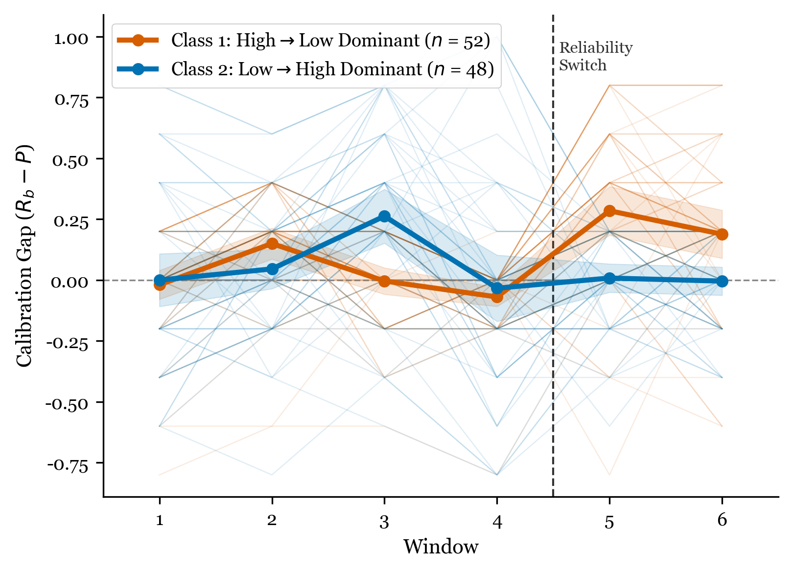
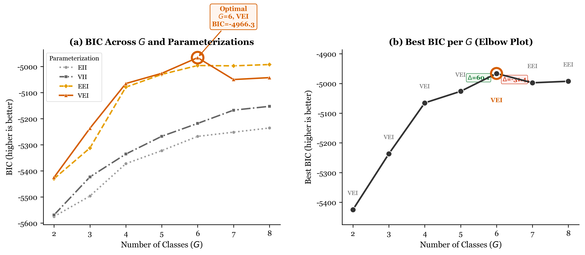

Running head: TRUST CALIBRATION TRAJECTORIES

**Trust Calibration Trajectories Under Experimental Reliability Switches:**

**A Latent Class Growth Analysis of Chess Puzzle Solving With AI Recommendations**

Hosung You

College of Education, Pennsylvania State University

**Author Note**

Hosung You [INSERT ORCID]

College of Education, Pennsylvania State University.

This study was pre-registered on the Open Science Framework (https://doi.org/10.17605/OSF.IO/JMQ84). The dataset analyzed in this study is publicly available from Bondi et al. (2023). The author has no conflicts of interest to disclose.

Correspondence concerning this article should be addressed to Hosung You, College of Education, Pennsylvania State University, University Park, PA 16802. Email: hosung@psu.edu

---

**Abstract**

Trust calibration---the alignment between a user's reliance on an AI system and the system's actual reliability---is critical for effective human-AI collaboration. While prior research has examined trust as a unidimensional construct, few studies have investigated the heterogeneity of trust calibration *trajectories* over time. Using data from an experimental chess puzzle study (*N* = 100 sessions from 50 participants across two conditions), we applied Latent Class Growth Analysis (LCGA) as the primary analytic method, supplemented by exploratory Gaussian Mixture Model (GMM) clustering to probe within-condition heterogeneity. LCGA identified two robust trajectory classes corresponding to experimental conditions (Entropy = 0.871, 96% classification accuracy), confirming the manipulation's effectiveness as the dominant driver of trust calibration dynamics. Exploratory GMM analysis suggested further within-condition differentiation: in the High-to-Low reliability condition, a majority subgroup (60%) exhibited Catastrophic over-reliance (trust inertia despite AI accuracy dropping from ~80% to ~20%), while 40% showed rapid Convergent adaptation. In the Low-to-High condition, 50% converged gradually, 28% oscillated, and 18% showed a pattern consistent with AI Benefit Emergence (ABE)---persistent under-reliance despite AI improvement---a pattern previously identified in large-scale educational data (*N* = 4,568; You, 2026). Given the modest sample size (50 sessions per condition), the GMM subgroups should be interpreted as exploratory; the convergence with independently identified patterns in a larger dataset strengthens confidence in these findings while highlighting the need for larger-sample replication.

*Keywords:* trust calibration, human-AI interaction, latent class growth analysis, trust trajectory, reliability switch, automation trust

---

**Trust Calibration Trajectories Under Experimental Reliability Switches: A Latent Class Growth Analysis of Chess Puzzle Solving With AI Recommendations**

## Trust Calibration in Human-AI Interaction

The rapid integration of artificial intelligence systems into decision-making contexts---from medical diagnosis to educational tutoring---has elevated the importance of appropriate reliance on AI recommendations. Trust calibration, defined as the correspondence between a user's trust in an AI system and the system's actual trustworthiness, is essential for effective human-AI collaboration (Lee & See, 2004). Miscalibrated trust leads to two types of errors: over-reliance (following AI recommendations when the system is unreliable) and under-reliance (ignoring AI recommendations when the system is reliable; Parasuraman & Riley, 1997).

Prior research has primarily examined trust as a static or aggregate construct, measuring overall trust levels or mean reliance rates across experimental conditions (e.g., Dzindolet et al., 2003). However, trust is inherently dynamic---it develops, fluctuates, and sometimes deteriorates over the course of interaction (Lee & Moray, 1992; Muir & Moray, 1996). Understanding these dynamics requires moving beyond aggregate measures to examine individual trust *trajectories* over time. Recent theoretical developments suggest that individuals do not follow a single, universal trust adaptation pattern; instead, qualitatively distinct trajectory types may emerge depending on individual differences in trust updating mechanisms and the specific environmental conditions encountered (You, 2026).

## A Bayesian Trust Update Model

To account for this heterogeneity, we adopt a Bayesian Trust Update Model in which trust at time *t* + 1 is updated according to a prediction error signal:

$$T_{t+1} = T_t + \begin{cases} \alpha^+ \cdot \delta_t & \text{if } \delta_t \geq 0 \\ \alpha^- \cdot \delta_t & \text{if } \delta_t < 0 \end{cases}$$

where $\delta_t = R_t - T_t$ is the prediction error (discrepancy between observed AI reliability and current behavioral trust), and $\alpha^+$ and $\alpha^-$ are asymmetric learning rates for positive and negative prediction errors, respectively. The key insight is that $\alpha^+$ and $\alpha^-$ need not be equal: individuals may update trust more readily in response to positive evidence (AI succeeding) than negative evidence (AI failing), or vice versa. This asymmetry generates qualitatively distinct trajectory patterns, including regions of over-reliance (when behavioral trust exceeds AI capability) and under-reliance (when behavioral trust falls below AI capability).

## Predicted Trajectory Patterns

Different configurations of $\alpha^+$ and $\alpha^-$ generate qualitatively distinct trajectory patterns. Three patterns are derivable from the model on theoretical grounds:

1. **Convergent** ($\alpha^+, \alpha^- > \alpha_{min}$): Trust gradually converges toward actual reliability. Both learning rates are active and sufficient.

2. **Stagnant** ($\alpha^+ \approx \alpha^- \approx 0$): Trust remains fixed near its initial level, unresponsive to changes in AI reliability.

3. **Catastrophic** ($\alpha^- \approx 0$; requires $R \downarrow$): When reliability drops, the individual fails to reduce trust, maintaining over-reliance.

Two additional patterns were identified through exploratory analysis of large-scale educational data (*N* = 4,568 learners; You, 2026) and subsequently formalized within the model:

4. **Oscillating** (nonlinear or threshold-dependent $\alpha$): Trust fluctuates non-monotonically, failing to achieve stable convergence.

5. **AI Benefit Emergence (ABE)** ($\alpha^+ \approx 0$; requires $R \uparrow$): When reliability improves, the individual fails to increase trust, maintaining under-reliance. The mathematical mirror of the Catastrophic pattern.

## The Present Study

The present study applies this theoretical framework to an experimental dataset featuring an explicit AI reliability switch, providing an ideal testbed for identifying trust calibration trajectories. We analyze data from Bondi et al. (2023), in which participants solved chess puzzles with AI recommendations under two conditions: High-to-Low reliability (C1: AI accuracy ~80% then ~20%) and Low-to-High reliability (C2: AI accuracy ~20% then ~80%; see Figure 1). This design creates a powerful within-subject test: C1 forces participants from the calibrated region toward potential over-reliance as reliability drops, while C2 forces participants toward potential under-reliance as reliability increases. Whether and how quickly participants recalibrate reveals their trust updating characteristics.

We employ two complementary analytic approaches:

- **Latent Class Growth Analysis (LCGA)** to identify distinct trajectory *shapes* over time, modeling the temporal structure explicitly through piecewise linear growth curves.
- **Gaussian Mixture Model (GMM) clustering** to identify distinct behavioral *profiles* based on trajectory features, capturing within-condition heterogeneity.

### Research Questions

**RQ1:** Does the experimental reliability switch produce distinct trust calibration trajectory classes? (LCGA)

**RQ2:** Within each experimental condition, what distinct trajectory patterns emerge? (GMM)

**RQ3:** Do the empirically identified patterns correspond to the five predicted trajectory types?

**RQ4:** How do LCGA and GMM results relate to each other, and what complementary insights does each method provide?

### Hypotheses

**H1:** LCGA will identify at least two trajectory classes, primarily differentiated by experimental condition.

**H2:** In the C1 (High-to-Low) condition, at least two subgroups will emerge: one showing Catastrophic over-reliance (trust inertia) and one showing Convergent adaptation.

**H3:** In the C2 (Low-to-High) condition, at least two subgroups will emerge, including an ABE pattern (persistent under-reliance despite AI improvement).

**H4:** The Convergent pattern will be the most prevalent across both conditions.

**H5:** The calibration gap trajectory will show stronger condition differentiation than the raw behavioral reliance trajectory.

---

## Method

### Data Source

We conducted a secondary analysis of the experimental dataset from Bondi et al. (2023). The original study investigated human decision-making in chess puzzles with AI assistance.

### Participants and Design

The dataset comprised *N* = 100 sessions from 50 participants, each completing two sessions in different conditions. The study used a within-subject design with two conditions: C1 (High-to-Low), in which AI accuracy was approximately 80% in Windows 1--4 and then approximately 20% in Windows 5--6; and C2 (Low-to-High), in which AI accuracy was approximately 20% in Windows 1--4 and then approximately 80% in Windows 5--6. Participants selected the best chess move from options, with AI recommendations provided. Each session comprised 30 trials organized into six windows of five trials each. The reliability switch occurred between trials 20 and 21 (between Window 4 and Window 5).

### Ethical Considerations and Data Access

The dataset is publicly available from the original authors. Our secondary analysis was pre-registered on the Open Science Framework (OSF; https://doi.org/10.17605/OSF.IO/JMQ84).

### Measures

**Behavioral Reliance Rate (*R*~b~).** Behavioral reliance rate was computed as the number of trials where the participant followed the AI recommendation divided by the total trials in a given window. This was computed per window (five trials each), yielding six time points per session.

**AI Accuracy (*P*).** AI accuracy was computed as the number of trials where the AI recommendation was correct divided by the total trials in a given window. AI accuracy was coded as `multiPV == 1`---that is, a trial was scored as AI-accurate when the AI's suggested move was the chess engine's top-ranked move. Approximate values were ~80% (high reliability) or ~20% (low reliability) per window, with exact values varying due to the specific puzzles presented.

**Calibration Gap (*G*).** The calibration gap, defined as *G* = *R*~b~ -- *P*, served as the primary outcome measure. Positive values indicate over-reliance (following AI more than warranted); negative values indicate under-reliance.

**Operationalization of Behavioral Trust.** Following the behavioral tradition in automation trust research (Lee & See, 2004), we operationalized trust as *observed behavioral reliance* rather than self-reported trust. Specifically, on each trial, participants saw the AI's recommended chess move and made a final move selection. A trial was coded as *AI-followed* if the participant's final move (bmove2) matched the AI suggestion (aisugg), regardless of whether the participant's initial choice (bmove1) differed. This binary coding captures the revealed preference---what the participant actually *did* with the AI recommendation---as distinct from what they *said* about their trust. The behavioral reliance rate *R*~b~ is the proportion of AI-followed trials within each window.

### Analytic Strategy

#### Phase 1: Descriptive Analysis

Window-level descriptive statistics by condition were computed, with particular focus on the switch effect between Windows 4 and 5.

#### Phase 2: Latent Class Growth Analysis

We used the `lcmm` R package (Proust-Lima et al., 2017) with the `hlme()` function to fit piecewise linear growth models to the calibration gap trajectory. The growth model was specified as:

$$G_{it} = \beta_0 + \beta_1 \cdot \text{Time}_t + \beta_2 \cdot \text{PostSwitch}_t + e_{it}$$

where Time~*t*~ = *t* -- 1 (ranging from 0 to 5) and PostSwitch~*t*~ = max(0, Time~*t*~ -- 3.5), a piecewise slope capturing post-switch trajectory change. A random intercept was specified (random = ~1). We fit models with *G* = 1 through 6 classes, using 30 random starting values per model (`gridsearch(rep = 30)`). Model selection was based on *BIC* (primary), SABIC, and entropy (for classification quality).

#### Phase 3: Gaussian Mixture Model Clustering

We used the `mclust` R package (Scrucca et al., 2016) to cluster sessions based on trajectory features extracted from the window-level data. Twenty features per session were extracted, including slopes, standard deviations, reversals, and maximum drops for *R*~b~, *G*, and appropriate reliance. Model selection was conducted using *BIC* across all Gaussian mixture model parameterizations (VEI, EII, etc.) and class numbers (*G* = 1 through 10).

#### Phase 4: Cross-Method Comparison

The Adjusted Rand Index (ARI) and cross-tabulation between LCGA and GMM class assignments were computed to evaluate convergence across analytic methods.

---

## Results

### Descriptive Results

The experimental manipulation produced large effects on the calibration gap. In C1 (High-to-Low), the calibration gap shifted from *M* = --0.164 (pre-switch) to *M* = +0.302 (post-switch), *d* = 2.10. The Window 4 to Window 5 jump was +0.568 (*SD* = 0.278). In C2 (Low-to-High), the calibration gap shifted from *M* = +0.211 (pre-switch) to *M* = --0.264 (post-switch), *d* = --2.06. The Window 4 to Window 5 jump was --0.612 (*SD* = 0.284). Both conditions showed very large effect sizes (|*d*| > 2.0), confirming that the reliability switch was a potent experimental manipulation.

### LCGA Results

#### Calibration Gap Trajectory Classes

Table 1 presents the model selection results for the calibration gap LCGA models. The two-class model was selected based on the lowest *BIC* (369.1), which was lower than the three-class model by a margin of 15.6 (see Table 1). Entropy for the two-class solution was 0.871, indicating good classification quality.

Class 1 (*n* = 52) consisted of 49 C1 and three C2 sessions. Class 2 (*n* = 48) consisted of 47 C2 and one C1 session. This represents 96% accuracy in condition classification, confirming that the experimental condition is the dominant determinant of the calibration gap trajectory (see Figure 2).

#### Behavioral Reliance Trajectory Classes

Behavioral reliance (*R*~b~) trajectories also yielded a two-class solution (*BIC* = 84.4, Entropy = 0.718), but with weaker condition separation: Class 1 (*n* = 88, all C1 + 39 C2) versus Class 2 (*n* = 12, one C1 + 11 C2). This supports H5: the calibration gap is a more sensitive indicator of condition effects than raw behavioral reliance.

### GMM Results

The six-class VEI model was selected based on *BIC* optimization across all parameterizations and class numbers (*G* = 2--8). As shown in Figure 4, the VEI parameterization consistently achieved the highest *BIC* across all values of *G*, with the optimal solution at *G* = 6 (*BIC* = --4966.3). The *BIC* improvement from *G* = 5 to *G* = 6 ($\Delta$BIC = +60.1) was substantial, while *G* = 7 showed a decline ($\Delta$BIC = --31.4), confirming the six-class solution as optimal. All six classes achieved perfect condition separation (100% C1 or 100% C2 within each class), indicating that condition-driven variance dominated the feature space (see Figure 3 and Table 2). Given the sample size (*N* = 100), the GMM results should be interpreted as exploratory rather than confirmatory; the smallest classes (Class 4, *n* = 9; Class 6, *n* = 2) warrant particular caution.

#### C1 (High-to-Low) Subgroups

**Class 5: Catastrophic Over-Reliance (*n* = 30, 60% of C1).** Despite AI accuracy plummeting from 0.800 to 0.200, *R*~b~ remained essentially flat, decreasing by only 0.080 (from 0.700 to 0.620). The calibration gap jumped by +0.720, representing severe over-reliance. At Window 5 (post-switch), *R*~b~ = 0.620, AI accuracy = 0.200, and the calibration gap was +0.420. This pattern persisted at Window 6 (*R*~b~ = 0.620, gap = +0.420). This corresponds to the Catastrophic pattern ($\alpha^- \approx 0$; see Table 4).

**Class 1: Rapid Convergent Adaptation (*n* = 20, 40% of C1).** Behavioral reliance dropped by 0.460 upon the switch---a rapid, adaptive response. At Window 5, *R*~b~ = 0.310, AI accuracy = 0.200, and the calibration gap was +0.110, indicating near-appropriate calibration. This corresponds to the Convergent pattern ($\alpha^+, \alpha^- > \alpha_{min}$; see Table 4).

#### C2 (Low-to-High) Subgroups

**Class 3: Gradual Convergent Adaptation (*n* = 25, 50% of C2).** By Window 6, this group achieved a calibration gap of --0.072, approaching perfect calibration. Behavioral reliance increased from 0.280 to 0.728 as AI accuracy improved from 20% to 80%.

**Class 2: Oscillating Adaptation (*n* = 14, 28% of C2).** A non-monotonic *R*~b~ trajectory was observed (0.529, 0.571, 0.671, 0.357, 0.457, 0.429), with the highest gap variability (*SD*~gap~ = 0.421). This corresponds to the Oscillating pattern.

**Class 4: AI Benefit Emergence (*n* = 9, 18% of C2).** Despite AI accuracy of 80%, *R*~b~ remained at 0.200 and even *decreased* from Window 5 (*R*~b~ = 0.267) to Window 6 (*R*~b~ = 0.200). The calibration gap of --0.600 at Window 6 indicates severe under-reliance. This corresponds to the ABE pattern ($\alpha^+ \approx 0$; see Table 4).

**Class 6: Extreme Compliance (*n* = 2, 4% of C2).** Two sessions showed near-100% AI following regardless of accuracy. Given that this class comprises only two sessions, it is best interpreted as an outlier phenomenon (extreme automation compliance) rather than a robust behavioral subgroup; we retain it descriptively but exclude it from substantive theoretical interpretation.

### Theoretical Pattern Mapping

Table 2 summarizes the mapping from empirically observed GMM classes to predicted trajectory patterns. Five of six GMM classes correspond to the five predicted patterns. The sixth class (Extreme Compliance, *n* = 2) is an outlier case retained for descriptive completeness but not interpreted as a distinct theoretical pattern given its minimal size.

### Cross-Method Comparison

The Adjusted Rand Index between LCGA (*G* = 2) and GMM (*G* = 6) class assignments was ARI = .362, reflecting moderate agreement (see Table 3 and Figure 5). Cross-tabulation revealed that LCGA Class 1 (C1-dominant) comprised GMM Class 1 (Convergent) and GMM Class 5 (Catastrophic), while LCGA Class 2 (C2-dominant) comprised GMM Classes 2, 3, and 4 (Oscillating, Convergent, and ABE, respectively). This confirms that LCGA captures condition-level macro-structure while GMM captures within-condition micro-heterogeneity. The two methods provide complementary, not redundant, information.

### Hypothesis Evaluation

Table 5 summarizes the evaluation of each hypothesis against the empirical results.

**H1** (LCGA identifies at least two trajectory classes differentiated by condition): **Supported.** LCGA yielded *G* = 2 with 96% condition classification accuracy and Entropy = 0.871.

**H2** (C1 contains Catastrophic and Convergent subgroups): **Supported.** GMM identified Class 5 (Catastrophic, 60% of C1) and Class 1 (Convergent, 40% of C1) within the C1 condition.

**H3** (C2 contains an ABE subgroup): **Supported.** GMM Class 4 (ABE, 18% of C2) was identified within C2, alongside Convergent (50%) and Oscillating (28%) subgroups.

**H4** (Convergent pattern is the most prevalent): **Partially disconfirmed.** Convergent was the most prevalent pattern overall (45%, combining Classes 1 and 3), but within C1, Catastrophic (60%) outnumbered Convergent (40%). The dominance of non-adaptive responding in the trust violation condition was not anticipated.

**H5** (Calibration gap shows stronger condition separation than *R*~b~): **Supported.** LCGA on the calibration gap achieved 96% condition classification accuracy versus *R*~b~'s weak separation (88 vs. 12 class split).

---

## Discussion

### Summary of Findings

This study examined trust calibration trajectories following experimental AI reliability switches, employing LCGA as the primary analytic method and exploratory GMM clustering as a supplementary probe of within-condition heterogeneity. Four of five hypotheses were supported (H1, H2, H3, H5), with H4 partially disconfirmed. The central finding is that LCGA robustly identified two trajectory classes corresponding to experimental conditions (*G* = 2, Entropy = 0.871, 96% classification accuracy), establishing the reliability switch as the dominant driver of trust calibration dynamics. Beyond this condition-level structure, exploratory GMM analysis suggested five within-condition subgroups---Convergent, Catastrophic, Oscillating, ABE, and Extreme Compliance---that align with patterns predicted by the Bayesian Trust Update Model and, for ABE and Oscillating, with patterns independently identified in large-scale educational data (*N* = 4,568; You, 2026). Given the modest sample size (*N* = 100), the GMM subgroups are best regarded as hypothesis-generating; the cross-domain convergence with the larger EdNet dataset strengthens confidence in their substantive meaning while underscoring the need for larger-sample replication.

### Trust Violation Produces Bifurcated Responses

The most striking finding is the 60:40 split within the C1 (High-to-Low) condition. Sixty percent of participants exhibited Catastrophic over-reliance after the trust violation---maintaining high AI following (*R*~b~ dropped only 0.080) despite AI accuracy plummeting from 100% to 20%. The remaining 40% showed rapid Convergent adaptation (*R*~b~ dropped 0.460).

This bifurcation indicates that trust violation does not produce a uniform response. Instead, it activates qualitatively different trust updating mechanisms in different individuals. In terms of the Bayesian model, Catastrophic responders have $\alpha^- \approx 0$ (failure to learn from negative prediction errors), while Convergent responders have functional $\alpha^-$.

This finding extends prior work on automation complacency (Parasuraman et al., 1993) by demonstrating that complacency is not universal but characterizes a majority subgroup (60%), with a substantial minority capable of rapid recalibration. The 60% prevalence of Catastrophic over-reliance is particularly concerning for safety-critical domains, where continued reliance on a degraded system can have severe consequences.

### Trust Repair Reveals Three Distinct Pathways

In the C2 (Low-to-High) condition, three distinct adaptation pathways emerged:

- **Gradual Convergence (50%).** The most common response, achieving near-perfect calibration (gap = --0.072 by Window 6).
- **Oscillation (28%).** Non-monotonic fluctuation, suggesting threshold-dependent or overshooting trust updating.
- **ABE (18%).** Persistent under-reliance (gap = --0.600) despite 80% AI accuracy.

The diversity of C2 responses indicates that trust building is not a unitary process. Even when an AI system demonstrably improves, a substantial minority of users (18% ABE + 28% Oscillating = 46%) fail to reach appropriate calibration within the observation period, suggesting that trust repair after an initial negative experience requires more than simple exposure to improved performance.

### Trust Hysteresis: Asymmetric Erosion and Building

The comparison between C1 (trust erosion) and C2 (trust building) reveals a striking asymmetry consistent with trust hysteresis. In C1, 60% of participants showed Catastrophic non-adaptation ($\alpha^- \approx 0$)---they failed to reduce trust when *R* dropped. In C2, 50% showed gradual Convergent adaptation but 18% showed ABE non-adaptation ($\alpha^+ \approx 0$). The fact that non-adaptation was more prevalent in the erosion direction (60%) than the building direction (18%) is consistent with the canonical trust asymmetry (trust is harder to destroy than to build; Lee & Moray, 1992), but with an important nuance: the Catastrophic pattern represents a failure to *erode* trust (the opposite of what standard asymmetry predicts). This suggests that automation complacency (Goddard et al., 2012; Parasuraman et al., 1993) creates an additional barrier to downward recalibration beyond what simple learning rate asymmetry would predict. In decision field theory terms (Gao & Lee, 2006), the subjective evaluation of automation performance may be biased by prior positive experiences, creating an inertial force that resists trust erosion even in the face of clear reliability declines.

### ABE: A Novel Pattern With Practical Significance

The AI Benefit Emergence pattern merits special attention as a theoretically and practically significant finding. ABE was first identified inductively in large-scale educational data (*N* = 4,568 learners; You, 2026), where a substantial subgroup (*n* = 451, 9.9%) persistently under-relied on an AI tutoring system despite its demonstrated accuracy. The present study provides suggestive experimental evidence for the same pattern. The cross-domain convergence is noteworthy: ABE participants in the EdNet dataset (gap $\approx$ --0.600, *n* = 451) and in the chess experiment (gap = --0.600, *n* = 9) exhibited nearly identical calibration gaps despite fundamentally different task domains (education vs. chess), sample characteristics (K-12 learners vs. adults), sample sizes, and study designs (observational vs. experimental). While the chess ABE subgroup is small (*n* = 9) and must be interpreted cautiously, the quantitative alignment with an independently identified pattern in a dataset 50 times larger lends credibility that exceeds what the chess sample alone could provide.

This cross-domain replication suggests that ABE reflects a robust individual difference in trust updating---specifically, a near-zero positive learning rate ($\alpha^+ \approx 0$) that prevents upward recalibration even in the face of sustained positive evidence. ABE participants appear anchored to their initial negative impression of the AI system, consistent with first-impression effects and negativity bias in social judgment (Tversky & Kahneman, 1974). In the chess context, these individuals experienced the AI performing at ~20% accuracy during the first 20 trials and were subsequently unable to revise their behavioral reliance upward when the AI improved to ~80% accuracy. The fact that ABE participants' reliance actually *decreased* from Window 5 (*R*~b~ = 0.267) to Window 6 (*R*~b~ = 0.200) suggests active resistance to the AI rather than passive inattention.

For AI system deployment, ABE has direct practical implications. It suggests that the initial user experience with an AI system may create lasting impressions that are resistant to subsequent positive evidence. Systems that are deployed before they reach high reliability risk creating a population of ABE users who will persistently under-utilize the system even after substantial improvements.

### Implications for Adaptive AI System Design

The trajectory patterns suggested by this study---robust at the condition level (LCGA) and exploratory at the subgroup level (GMM)---carry several implications for the design of AI systems that must maintain appropriate user trust. We frame these as design hypotheses warranting further empirical testing.

**Implication 1: Passive reliability changes are insufficient.** The finding that 60% of users in the Catastrophic class maintained over-reliance despite an 80-percentage-point drop in AI accuracy demonstrates that simply changing system reliability does not automatically update user trust. AI systems must actively communicate reliability changes---for example, through explicit uncertainty displays, confidence indicators, or performance dashboards---rather than assuming users will detect and respond to performance shifts on their own.

**Implication 2: Personalized trust calibration interventions.** The five-pattern typology enables a move from one-size-fits-all interventions to targeted, profile-specific support. Catastrophic-prone users ($\alpha^- \approx 0$) need explicit warnings or trust violation signals when system reliability declines. ABE-prone users ($\alpha^+ \approx 0$) need sustained positive evidence and gradual trust-building scaffolds, potentially including explanations of AI reasoning to support upward recalibration. Oscillating users may benefit from stable reliability exposure during early interactions to establish a consistent baseline.

**Implication 3: First impressions matter for AI adoption.** The ABE pattern demonstrates that initial negative experiences with an AI system create lasting under-reliance that is resistant to subsequent improvement. This finding has direct implications for AI rollout strategy: organizations should ensure that AI systems achieve high reliability during onboarding and early use phases. A premature deployment with mediocre reliability may permanently suppress adoption for a non-trivial fraction of users (18% in this study), even after the system improves substantially.

**Implication 4: The learning rate parameters as design targets.** The Bayesian Trust Update Model's $\alpha^+$ and $\alpha^-$ parameters offer a framework for predictive personalization. Future adaptive systems could estimate individual learning rates from early interaction data---for instance, by observing how quickly a user adjusts reliance in response to the first few successes or failures---and then adjust the interface accordingly. Users with low $\alpha^-$ (complacency-prone) could receive more salient reliability feedback; users with low $\alpha^+$ (ABE-prone) could receive explanatory support. This moves trust calibration from a reactive process (detecting miscalibration after it occurs) to a proactive one (predicting and preventing it based on individual parameters).

### Complementary Methods: LCGA and GMM

Our dual-method approach illustrates how trajectory-explicit (LCGA) and feature-based (GMM) clustering can serve different roles in trust calibration research. LCGA provided the primary, inferentially robust finding: the experimental manipulation produces two distinct trajectory classes with 96% condition separation. GMM served an exploratory role, probing within-condition heterogeneity to suggest behavioral subgroups that align with theoretically predicted patterns. Cross-method comparison (ARI = .362) confirms that the methods capture different levels of structure---condition-level macro-patterns (LCGA) versus within-condition micro-heterogeneity (GMM)---providing complementary rather than redundant information. For future studies with larger samples, this layered approach could move from hypothesis generation (as here) to confirmatory testing of within-condition subgroups.

### Limitations and Future Directions

Several limitations should be noted. First, the sample size (*N* = 100 sessions, 50 per condition) is below the commonly recommended minimum of 200 for GMM (Nylund et al., 2007). The GMM six-class solution should therefore be interpreted as exploratory and hypothesis-generating rather than confirmatory. In particular, Class 6 (*n* = 2) represents extreme outlier cases rather than a robust subgroup, and Class 4 (ABE, *n* = 9) is at the boundary of reliable estimation given the 20-feature trajectory space. The LCGA results (*G* = 2, Entropy = 0.871) rest on more solid inferential ground given the simpler model structure. Second, six windows (five trials each) provide limited temporal resolution for distinguishing true oscillation from measurement noise. Third, chess puzzles represent a specific domain; generalization to other human-AI interaction contexts requires further study. Fourth, each participant completed both conditions, meaning carry-over effects between sessions cannot be fully ruled out. Fifth, this study is registered as a secondary analysis of existing data. While analyses were pre-registered, the data were observed prior to the analysis plan (as disclosed in the pre-registration). Sixth, the GMM results showed low cross-strategy agreement (ARI = 0.088--0.243 between feature strategies), indicating that the identified subgroups are sensitive to feature selection, a common limitation in small-sample clustering applications.

Future research should address these limitations through larger-sample studies with finer temporal resolution, extend the paradigm to applied domains (e.g., medical diagnosis, autonomous driving), and directly test whether identifying users' trust updating profiles early in an interaction enables effective personalized interventions. The development of real-time $\alpha$ estimation algorithms and their integration into adaptive AI interfaces represents a promising translational direction.

## Conclusion

This study provides experimental evidence that AI reliability switches produce two robustly distinguishable trust calibration trajectory classes (LCGA: *G* = 2, 96% condition separation, Entropy = 0.871), confirming that the direction of reliability change is the dominant driver of trust dynamics. Exploratory GMM analysis further suggested within-condition heterogeneity consistent with the Bayesian Trust Update Model's predictions---including Convergent, Catastrophic, Oscillating, and ABE patterns---several of which converge with independently identified patterns in large-scale educational data (*N* = 4,568; You, 2026). Given the modest sample size, the GMM-derived subgroups should be treated as hypotheses for future confirmatory research rather than established findings. Nonetheless, the suggestive prevalence of Catastrophic over-reliance (~60% of trust violation sessions) and ABE under-reliance (~18% of trust repair sessions) highlights that passive reliability changes may be insufficient to recalibrate user trust, motivating the development of adaptive AI systems that actively detect and support individual trust updating profiles.

---

## References

Bondi, A., Kuo, Y.-L., Parvez, M. R., & Shah, J. (2023). Role of human-AI interaction in selective prediction. *Proceedings of the AAAI Conference on Artificial Intelligence*, *37*(5), 5286--5294. https://doi.org/10.1609/aaai.v37i5.25684

Dzindolet, M. T., Peterson, S. A., Pomranky, R. A., Pierce, L. G., & Beck, H. P. (2003). The role of trust in automation reliance. *International Journal of Human-Computer Studies*, *58*(6), 697--718. https://doi.org/10.1016/S1071-5819(03)00038-7

Gao, J., & Lee, J. D. (2006). Extending the decision field theory to model operators' reliance on automation in supervisory control of multiple robots. *IEEE Transactions on Systems, Man, and Cybernetics---Part A: Systems and Humans*, *36*(5), 943--959. https://doi.org/10.1109/TSMCA.2006.878984

Goddard, K., Roudsari, A., & Wyatt, J. C. (2012). Automation bias: A systematic review of frequency, effect mediators, and mitigators. *Journal of the American Medical Informatics Association*, *19*(1), 121--127. https://doi.org/10.1136/amiajnl-2011-000089

Lee, J. D., & Moray, N. (1992). Trust, control strategies and allocation of function in human-machine systems. *Ergonomics*, *35*(10), 1243--1270. https://doi.org/10.1080/00140139208967392

Lee, J. D., & See, K. A. (2004). Trust in automation: Designing for appropriate reliance. *Human Factors*, *46*(1), 50--80. https://doi.org/10.1518/hfes.46.1.50.30392

Nylund, K. L., Asparouhov, T., & Muthén, B. O. (2007). Deciding on the number of classes in latent class analysis and growth mixture modeling: A Monte Carlo simulation study. *Structural Equation Modeling*, *14*(4), 535--569. https://doi.org/10.1080/10705510701575396

Muir, B. M., & Moray, N. (1996). Trust in automation. Part II. Experimental studies of trust and human intervention in a process control simulation. *Ergonomics*, *39*(3), 429--460. https://doi.org/10.1080/00140139608964474

Parasuraman, R., Molloy, R., & Singh, I. L. (1993). Performance consequences of automation-induced "complacency." *The International Journal of Aviation Psychology*, *3*(1), 1--23. https://doi.org/10.1207/s15327108ijap0301_1

Parasuraman, R., & Riley, V. (1997). Humans and automation: Use, misuse, disuse, abuse. *Human Factors*, *39*(2), 230--253. https://doi.org/10.1518/001872097778543886

Proust-Lima, C., Philipps, V., & Liquet, B. (2017). Estimation of extended mixed models using latent classes and latent processes: The R package lcmm. *Journal of Statistical Software*, *78*(2), 1--56. https://doi.org/10.18637/jss.v078.i02

Scrucca, L., Fop, M., Murphy, T. B., & Raftery, A. E. (2016). mclust 5: Clustering, classification and density estimation using Gaussian finite mixture models. *The R Journal*, *8*(1), 289--317. https://doi.org/10.32614/RJ-2016-021

Tversky, A., & Kahneman, D. (1974). Judgment under uncertainty: Heuristics and biases. *Science*, *185*(4157), 1124--1131. https://doi.org/10.1126/science.185.4157.1124

You, H. (2026). Trust calibration trajectories in AI-assisted learning: A Bayesian trust update model with empirical evidence from large-scale educational data. *Manuscript in preparation*.

---

**Table 1**

*LCGA Model Selection Results for Calibration Gap Trajectories*

| Classes (*G*) | Log-Likelihood | Parameters | *BIC* | Entropy | Convergence |
|:-:|:-:|:-:|:-:|:-:|:-:|
| 1 | --226.5 | 5 | 476.0 | --- | 1 |
| **2** | **--163.8** | **9** | **369.1** | **0.871** | **1** |
| 3 | --162.4 | 13 | 384.7 | --- | 1 |
| 4 | --158.0 | 17 | 394.3 | --- | 1 |

*Note.* Bold indicates the selected model. The two-class solution was selected based on the lowest *BIC* value (margin of 15.6 over the three-class solution). Entropy is reported only for the selected multi-class model. Models were estimated using `hlme()` from the `lcmm` R package with 30 random starting values per model. Convergence: 1 = converged.

---

**Table 2**

*GMM Six-Class Solution: Descriptive Statistics and Theoretical Mapping*

| GMM Class | Theoretical Pattern | *n* (%) | Condition | Key Indicators |
|:-:|:--|:-:|:-:|:--|
| 1 | Convergent (rapid) | 20 (20%) | C1 | *R*~b~ drop of 0.460 at switch; post-switch gap = +0.110 |
| 2 | Oscillating | 14 (14%) | C2 | Non-monotonic *R*~b~; *SD*~gap~ = 0.421 |
| 3 | Convergent (gradual) | 25 (25%) | C2 | Gap = --0.072 by Window 6; gradual *R*~b~ increase |
| 4 | ABE | 9 (9%) | C2 | *R*~b~ = 0.200 despite 80% AI accuracy; gap = --0.600 |
| 5 | Catastrophic | 30 (30%) | C1 | *R*~b~ drop of only 0.080 at switch; post-switch gap = +0.420 |
| 6 | Extreme Compliance | 2 (2%) | C2 | Near-100% AI following regardless of accuracy |

*Note.* C1 = High-to-Low reliability condition; C2 = Low-to-High reliability condition. ABE = AI Benefit Emergence. Theoretical patterns are derived from the Bayesian Trust Update Model (You, 2026). All six classes achieved 100% condition purity.

---

**Table 3**

*Cross-Tabulation of LCGA and GMM Class Assignments*

| | GMM 1 (Convergent) | GMM 2 (Oscillating) | GMM 3 (Convergent) | GMM 4 (ABE) | GMM 5 (Catastrophic) | GMM 6 (Extreme Compliance) | Total |
|:--|:-:|:-:|:-:|:-:|:-:|:-:|:-:|
| LCGA Class 1 | 19 | 0 | 3 | 0 | 30 | 0 | 52 |
| LCGA Class 2 | 1 | 14 | 22 | 9 | 0 | 2 | 48 |
| Total | 20 | 14 | 25 | 9 | 30 | 2 | 100 |

*Note.* LCGA Class 1 is C1-dominant (49 C1, 3 C2 sessions). LCGA Class 2 is C2-dominant (47 C2, 1 C1 session). Adjusted Rand Index (ARI) = .362, indicating moderate agreement between the two classification methods.

---

**Table 4**

*Behavioral Reliance and Calibration Gap by Window and GMM Class*

| GMM Class | Pattern | *n* | W1 *R*~b~ | W1 Gap | W4 *R*~b~ | W4 Gap | W5 *R*~b~ | W5 Gap | W6 *R*~b~ | W6 Gap |
|:-:|:--|:-:|:-:|:-:|:-:|:-:|:-:|:-:|:-:|:-:|
| 1 | Convergent (rapid) | 20 | 0.630 | --0.170 | 0.770 | --0.230 | 0.310 | +0.110 | 0.340 | +0.140 |
| 2 | Oscillating | 14 | 0.529 | +0.329 | 0.357 | +0.357 | 0.457 | --0.343 | 0.429 | --0.371 |
| 3 | Convergent (gradual) | 25 | 0.280 | +0.080 | 0.288 | +0.288 | 0.592 | --0.208 | 0.728 | --0.072 |
| 4 | ABE | 9 | 0.133 | --0.067 | 0.222 | +0.222 | 0.267 | --0.533 | 0.200 | --0.600 |
| 5 | Catastrophic | 30 | 0.600 | --0.200 | 0.700 | --0.300 | 0.620 | +0.420 | 0.620 | +0.420 |
| 6 | Extreme Compliance | 2 | 0.900 | +0.700 | 1.000 | +1.000 | 1.000 | +0.200 | 1.000 | +0.200 |

*Note.* *R*~b~ = behavioral reliance rate; Gap = calibration gap (*R*~b~ -- AI accuracy). AI accuracy was approximately 0.800 in high-reliability windows and 0.200 in low-reliability windows. For C1 (Classes 1 and 5), Windows 1--4 are high-reliability and Windows 5--6 are low-reliability. For C2 (Classes 2, 3, 4, and 6), Windows 1--4 are low-reliability and Windows 5--6 are high-reliability. ABE = AI Benefit Emergence. Values are class means computed from window-level data.

---

**Table 5**

*Summary of Hypothesis Evaluation*

| Hypothesis | Prediction | Result | Verdict |
|:-:|:--|:--|:-:|
| H1 | LCGA identifies at least 2 classes by condition | *G* = 2, 96% condition separation | Supported |
| H2 | C1 contains Catastrophic + Convergent | Class 5 (60%) + Class 1 (40%) | Supported |
| H3 | C2 contains ABE subgroup | Class 4 (ABE, 18%) identified | Supported |
| H4 | Convergent is most prevalent | Overall 45%, but Catastrophic dominates C1 (60%) | Partially disconfirmed |
| H5 | Calibration gap > *R*~b~ for condition separation | 96% vs. 88/12 split | Supported |

---

**Figure 1**

*Experimental Design: AI Accuracy by Condition Across Windows*

*Note.* The figure illustrates the two experimental conditions. In C1 (High-to-Low), AI accuracy is approximately 80% in Windows 1--4 and drops to approximately 20% in Windows 5--6. In C2 (Low-to-High), AI accuracy is approximately 20% in Windows 1--4 and rises to approximately 80% in Windows 5--6. The vertical dashed line marks the reliability switch between Windows 4 and 5.

---

**Figure 2**

*LCGA Calibration Gap Trajectories by Class*

*Note.* Mean calibration gap trajectories for the two-class LCGA solution (*G* = 2). Class 1 (*n* = 52, C1-dominant) shows a shift from under-reliance to over-reliance at the switch point. Class 2 (*n* = 48, C2-dominant) shows a shift from over-reliance to under-reliance. Shaded bands represent 95% confidence intervals. Individual session trajectories are shown in light traces. Entropy = 0.871; classification accuracy = 96%.

---

**Figure 3**

*GMM Six-Class Trajectory Profiles*

*Note.* Trajectory profiles for the six-class GMM solution (Strategy 2, VEI parameterization), showing behavioral reliance (*R*~b~, solid line) and AI accuracy (dashed line) across six windows. Orange/red shading indicates over-reliance (*R*~b~ > AI accuracy); blue shading indicates under-reliance (*R*~b~ < AI accuracy). Classes are labeled by their theoretical pattern mapping: Convergent (rapid), Oscillating, Convergent (gradual), AI Benefit Emergence (ABE), Catastrophic, and Extreme Compliance. Given *N* = 100, these subgroups should be considered exploratory; Class 6 (*n* = 2) in particular represents extreme outlier cases.

---

**Figure 4**

*GMM Model Selection: BIC Across Parameterizations and Number of Classes*

*Note.* (a) Bayesian Information Criterion (BIC; higher is better) for Strategy 2 (trajectory features) GMM across four covariance parameterizations (EII, VII, EEI, VEI) and class numbers (*G* = 2--8). The VEI parameterization consistently achieved the highest BIC. (b) Best BIC per *G* showing the elbow at *G* = 6 (VEI, BIC = --4966.3). The $\Delta$BIC from *G* = 5 to *G* = 6 was +60.1 (substantial improvement), while the $\Delta$BIC from *G* = 6 to *G* = 7 was --31.4 (decline), supporting the six-class solution.

---

**Figure 5**

*Cross-Method Comparison: LCGA and GMM Class Assignments*

*Note.* Heatmap showing the cross-tabulation of LCGA (two classes) and GMM (six classes) assignments. Adjusted Rand Index (ARI) = .362, indicating moderate agreement. LCGA Class 1 (C1-dominant) comprises GMM Classes 1 (Convergent) and 5 (Catastrophic); LCGA Class 2 (C2-dominant) comprises GMM Classes 2 (Oscillating), 3 (Convergent), and 4 (ABE). This demonstrates that LCGA captures condition-level macro-structure while GMM captures within-condition micro-heterogeneity.
