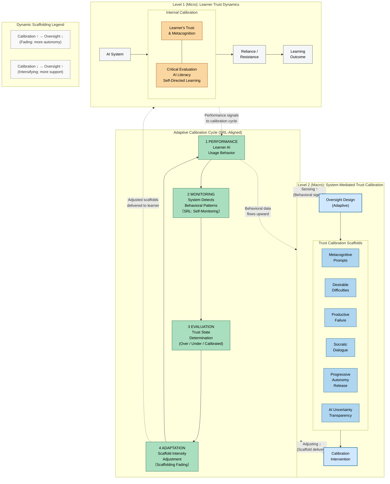

# Figure 2: Two-Level Framework for Trust Calibration Scaffolds

## Description

This diagram presents the core theoretical framework of the paper: a two-level model of AI trust calibration in educational contexts. Level 2 (Macro) represents the system-mediated scaffolding layer that observes learner behavior and adaptively intervenes. Level 1 (Micro) represents the internal learner dynamics — how trust and metacognition shape reliance on AI and learning outcomes. A central Adaptive Calibration Cycle connects the two levels, functioning as the engine that senses learner states and adjusts scaffold intensity accordingly.

---

## Mermaid Diagram

---

## Component Explanations

### Level 2 (Macro): System-Mediated Trust Calibration

This level represents the external, system-side layer of the framework — what the instructional or AI system does to detect and correct miscalibrated trust in learners.

**Oversight Design (Adaptive)**
The system continuously monitors learner behavior and adjusts its level of oversight. High oversight is applied when learners exhibit overtrust or undertrust; oversight fades as calibration improves. This adaptive design is grounded in Vygotsky's Zone of Proximal Development and Pea's (2004) notion of distributed scaffolding.

**Trust Calibration Scaffolds**
Six scaffold types are deployed depending on the detected trust state:

| Scaffold | Purpose |
|---|---|
| Metacognitive Prompts | Trigger reflection on AI reliance decisions ("Why did you accept this AI answer?") |
| Desirable Difficulties | Introduce productive challenges that prevent over-reliance (e.g., delayed AI feedback) |
| Productive Failure | Allow learners to struggle before AI assistance, building schema robustness |
| Socratic Dialogue | Use AI-generated questioning to surface reasoning and expose uncritical acceptance |
| Progressive Autonomy Release | Gradually reduce AI scaffolding as calibration improves (fading) |
| AI Uncertainty Transparency | Make AI confidence levels and error rates visible to learners |

**Calibration Intervention**
The concrete action delivered to the learner based on trust state evaluation. Interventions are targeted, not generic — they match the specific miscalibration pattern detected.

---

### Adaptive Calibration Cycle (Central Band)

This four-stage cycle, aligned with Self-Regulated Learning (SRL) theory (Zimmerman, 2000; Winne & Hadwin, 1998), is the operational engine of the framework. It runs continuously during learning interactions.

**Stage 1 — PERFORMANCE**
Observable learner behaviors: how often the learner accepts AI answers without verification, how frequently they override AI suggestions, time-on-task patterns, and error correction rates. These behavioral traces serve as proxies for underlying trust states.

**Stage 2 — MONITORING**
The system detects patterns in behavioral data that signal trust miscalibration. For example: consistent AI answer acceptance without self-checking (overtrust signal), or systematic AI avoidance even when AI reliability is high (undertrust signal). This maps to SRL's self-monitoring phase.

**Stage 3 — EVALUATION**
The system classifies the learner's current trust state into one of three categories:
- Overtrust: High trust in AI regardless of AI reliability
- Undertrust/Distrust: Low trust in AI even when AI reliability is high
- Calibrated: Trust appropriately tracks AI reliability

**Stage 4 — ADAPTATION**
Based on the evaluation, scaffold intensity is adjusted. If calibration is improving, scaffolds fade (Progressive Autonomy Release). If miscalibration persists or worsens, scaffolds intensify (e.g., adding Desirable Difficulties or Socratic Dialogue). This maps to SRL's adaptive help-seeking phase.

---

### Level 1 (Micro): Learner Trust Dynamics

This level represents the internal, cognitive layer of trust calibration — what happens inside the learner during AI interactions.

**AI System**
The AI tool with which the learner interacts (e.g., an AI tutor, a code assistant, a writing aid). The AI system has its own reliability profile — it is not uniformly accurate.

**Learner's Trust and Metacognition**
The core internal state. Trust here is not a binary on/off but a calibrated probabilistic judgment that should track AI reliability. Metacognition refers to the learner's capacity to monitor and regulate their own cognitive processes, including their reliance decisions.

**Internal Calibration Mechanisms**
- Critical Evaluation: The learner's tendency to verify, question, and compare AI outputs
- AI Literacy: Understanding of how AI systems work, their failure modes, and their limitations
- Self-Directed Learning (SDL): The learner's capacity to regulate their own learning without external prompts

**Reliance / Resistance**
The behavioral output of the trust-metacognition interaction. Reliance is AI usage; resistance is AI rejection. Calibrated behavior means reliance when AI is reliable and resistance when it is not.

**Learning Outcome**
Downstream effects on knowledge construction, skill development, and transfer. Miscalibrated trust (either overtrust or undertrust) degrades learning outcomes through different mechanisms: overtrust prevents effortful processing; undertrust foregoes beneficial AI support.

---

### Bidirectional Level Connections

The two levels communicate in both directions:

- **Sensing upward (Level 1 → Level 2)**: Learner performance signals (behavioral data) flow upward to feed the Monitoring and Evaluation stages of the calibration cycle.
- **Adjusting downward (Level 2 → Level 1)**: Calibration interventions are delivered downward to the learner, modifying the conditions of the AI-learner interaction.

This bidirectional flow ensures the framework is not a static prescription but a dynamic, responsive system that evolves with the learner's trust state over time.

---

### Dynamic Scaffolding Logic

| Trust Calibration State | System Response |
|---|---|
| Calibration improving | Oversight decreases — scaffold fading, expanded autonomy |
| Miscalibration detected or worsening | Oversight increases — scaffold intensification |

This logic mirrors the instructional scaffolding principle of contingent support (Wood, Bruner, & Ross, 1976): support is neither always present nor always absent, but calibrated to the learner's current need.
