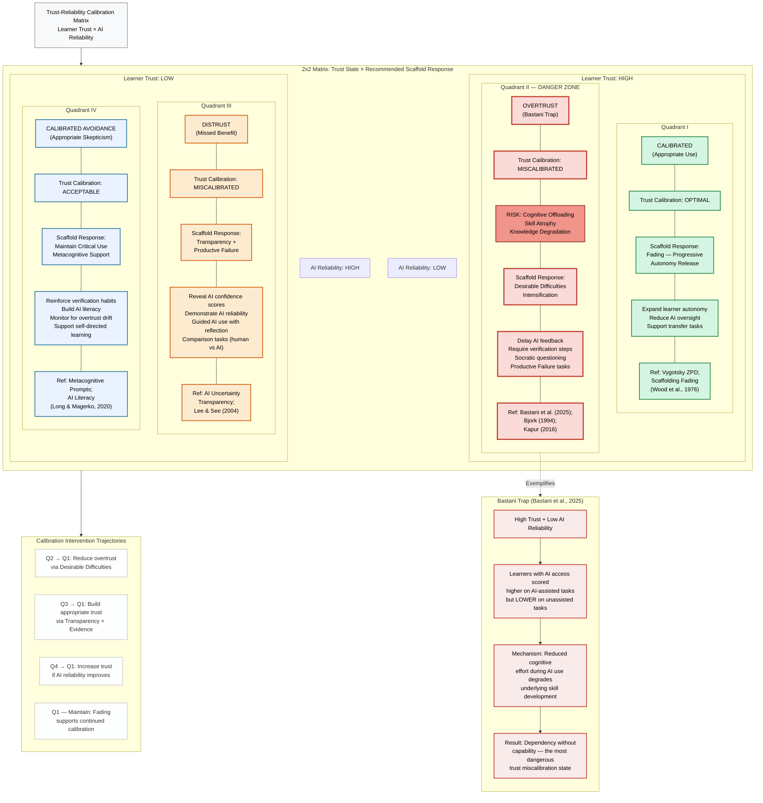

# Figure 3: Trust-Reliability Calibration Matrix

## Description

This 2x2 matrix maps the four possible combinations of learner trust level (High vs. Low) and AI reliability level (High vs. Low). Each quadrant represents a distinct trust calibration state with different implications for learning and different recommended scaffold responses. The matrix is grounded in the reliance literature (Lee & See, 2004; Parasuraman & Riley, 1997) and connects directly to the Bastani et al. (2025) empirical findings on AI-induced skill atrophy.

The critical insight of this framework is that "trust" is not inherently good or bad — its value depends entirely on whether it is matched to the actual reliability of the AI system. Only when trust appropriately tracks AI reliability does it support learning.

---

## Mermaid Diagram

---

## Quadrant-by-Quadrant Explanation

### Quadrant I — Calibrated (Appropriate Use)
**Condition**: High Learner Trust + High AI Reliability

This is the target state of the framework. The learner's trust in the AI system is warranted because the AI is genuinely reliable in this context. Trust-behavior alignment means the learner appropriately relies on AI for tasks where it adds value and applies critical evaluation when needed.

**Learning implications**: Cognitive effort is efficiently allocated. The learner leverages AI as a genuine cognitive partner without outsourcing the thinking that builds durable knowledge.

**Scaffold response — Fading (Progressive Autonomy Release)**: Because calibration is optimal, the system should reduce the intensity of oversight scaffolds. Continued heavy scaffolding here would be paternalistic and could impede autonomous skill development. The goal is graceful exit from scaffolded support toward self-regulated AI use.

**Key references**: Vygotsky's Zone of Proximal Development; Wood, Bruner, & Ross (1976) contingent scaffolding and fading; Zimmerman (2000) self-regulation.

---

### Quadrant II — Overtrust / Bastani Trap (DANGER ZONE)
**Condition**: High Learner Trust + Low AI Reliability

This is the most dangerous miscalibration state. The learner trusts AI outputs that are unreliable, unverified, or domain-inappropriate. Because trust is high, the learner exerts minimal cognitive effort — they accept AI answers without checking, reducing the very processing that builds knowledge.

**The Bastani Trap**: Bastani et al. (2025) demonstrated this experimentally. Students who used AI tutoring performed better on AI-assisted tasks but significantly worse on unassisted follow-up tasks compared to controls. AI access created a performance illusion that masked underlying skill atrophy. The learner appears to be learning (they get right answers) but is not building transferable knowledge.

**Mechanism**: Cognitive offloading — when AI does the cognitive work, the learner's effort is reduced below the threshold needed for durable encoding and schema construction.

**Scaffold response — Desirable Difficulties Intensification**: The system must disrupt the comfortable overtrust state by:
- Delaying AI feedback (forcing initial independent attempts)
- Requiring learners to predict AI answers before seeing them
- Introducing AI errors intentionally (calibration training)
- Using Socratic Dialogue to expose uncritical acceptance
- Assigning Productive Failure tasks where AI is withheld

**Key references**: Bastani et al. (2025); Bjork (1994) desirable difficulties; Kapur (2016) productive failure; Sweller (2011) cognitive load theory.

---

### Quadrant III — Distrust (Missed Benefit)
**Condition**: Low Learner Trust + High AI Reliability

The learner systematically avoids or discounts AI outputs even when the AI is genuinely reliable. This results in missed opportunities for legitimate cognitive support, scaffolded practice, and efficient feedback. The learner's skepticism, while virtuous in Quadrant II, is maladaptive here.

**Learning implications**: The learner bears unnecessary cognitive load on tasks where AI assistance would free resources for higher-order processing. Progress is slower than necessary. In some cases, distrust may stem from prior negative AI experiences, AI anxiety, or low AI literacy.

**Scaffold response — Transparency and Productive Failure**: The system should build trust where it is warranted by:
- Making AI reliability metrics visible (confidence scores, error rate disclosures)
- Providing guided comparison tasks where the learner verifies AI accuracy directly
- Using Productive Failure to demonstrate cases where AI succeeds where the learner struggled unaided
- Building AI literacy to help the learner distinguish reliable from unreliable AI contexts

**Key references**: Lee & See (2004) trust in automation; AI Uncertainty Transparency literature; Logg, Minson, & Moore (2019) algorithm aversion.

---

### Quadrant IV — Calibrated Avoidance (Appropriate Skepticism)
**Condition**: Low Learner Trust + Low AI Reliability

The learner's low trust is epistemically justified — the AI system is actually unreliable in this context. The learner's skepticism and resistance represent accurate calibration. This state is not a failure; it is a sign that the learner's critical evaluation skills are functioning correctly.

**Learning implications**: The learner avoids being misled by unreliable AI, preserving the integrity of their knowledge construction. However, this state requires vigilance: learners may drift toward Quadrant II if AI reliability improves but their trust updating is slow.

**Scaffold response — Maintain Critical Use and Metacognitive Support**: The system should:
- Reinforce verification and checking habits that produced good calibration
- Continue metacognitive prompts that support ongoing critical evaluation
- Build AI literacy so the learner can detect future changes in AI reliability
- Monitor for overtrust drift if AI reliability improves in future system updates

**Key references**: Metacognitive prompting literature; Long & Magerko (2020) AI literacy competencies; Flavell (1979) metacognition.

---

## Connection to Bastani et al. (2025)

Bastani, H., Bastani, O., Sungu, A., Ge, H., Kabakcı, Ö., & Mariman, R. (2025). *Generative AI Can Harm Learning.* Management Science.

The Bastani et al. (2025) study is the central empirical anchor for the danger of Quadrant II. Their randomized controlled trial with high school math students found:

1. Students with AI tutor access performed significantly better on practice problems (AI-assisted performance advantage).
2. The same students performed significantly worse on unassisted exams (skill atrophy).
3. The performance gap was largest for students who used AI most intensively — suggesting dose-dependent skill degradation.
4. The effect was driven by reduced cognitive effort during AI use, not by AI providing wrong information.

**Theoretical interpretation within this framework**: The Bastani sample was trapped in Quadrant II conditions — learners trusted the AI tutor (it gave correct answers) but the AI reliability was functionally "low" in the sense that mattered for learning: it did not build transferable skill. High trust in AI correctness did not translate to appropriate epistemic trust (trust in AI as a learning scaffold vs. answer provider).

**Design implication**: The distinction between task performance reliability (AI gives correct answers) and learning-relevant reliability (AI promotes durable knowledge construction) is critical. A system can be high-reliability in the former sense and low-reliability in the latter. Calibration frameworks must account for both dimensions.

**Scaffold prescription**: Quadrant II → Quadrant I transitions require Desirable Difficulties precisely because they re-introduce the cognitive effort that overtrust eliminated. The temporary performance dip induced by desirable difficulties is the mechanism through which durable learning is restored.

---

## Calibration Intervention Trajectories

| Transition | Mechanism | Primary Scaffold |
|---|---|---|
| Q2 → Q1 | Reduce overtrust; restore effortful processing | Desirable Difficulties, Productive Failure, Socratic Dialogue |
| Q3 → Q1 | Build warranted trust; demonstrate AI reliability | AI Transparency, Guided Comparison, AI Literacy instruction |
| Q4 → Q1 | Gradual trust increase as AI reliability improves | Progressive AI introduction, Metacognitive monitoring |
| Q1 → maintain | Sustain calibrated state as AI reliability and task demands change | Progressive Autonomy Release (Fading) |

Note: Q1 is not a permanent destination. As AI systems change, task contexts shift, and learner expertise grows, continuous recalibration is required. The framework is designed for ongoing dynamic adjustment, not one-time correction.
